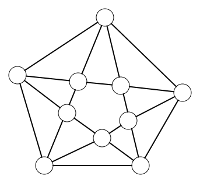

# Eulerian path (solution)

<h2 class="title">Assignment</h2>

Count the number of edges that depart from each node (= the degree of the node) of the graph of Königsberg. Is it possible to find an Eulerian path in the graph?

</img>

<strong>None of the nodes has an even degree. Therefore, it is impossible to find an Eulerian path in the graph.</strong>

<h2 class="title">Assignment</h2>

Look back at the following drawings. Which of these drawings can you draw without lifting your pen and which cannot?

<table>
  <tr>
    <th>Image Number</th>
    <th>Image</th>
  </tr>
  <tr>
    <td>1</td>
    <td></td>
  </tr>
  <tr>
    <td colspan=2><strong>Solution: </strong>There are two nodes with an odd degree. The rest of the nodes have an even degree. Consequently, an Eulerian path in the graph is possible.</td>
  </tr>
  <tr>
    <td>2</td>
    <td></td>
  </tr>
  <tr>
    <td colspan=2><strong>Solution: </strong>All nodes in the graph have an even degree. Consequently, an Eulerian path in the graph is possible.</td>
  </tr>
  <tr>
    <td>3</td>
    <td></td>
  </tr>
  <tr>
    <td colspan=2><strong>Solution: </strong>All nodes in the graph have an even degree. Consequently, an Eulerian path in the graph is possible.</td>
  </tr>
  <tr>
    <td>4</td>
    <td></td>
  </tr>
  <tr>
    <td colspan=2><strong>Solution: </strong>There are more than two nodes in the graph with an odd degree. Consequently, an Eulerian path in the graph is not possible.</td>
  </tr>
</table>

