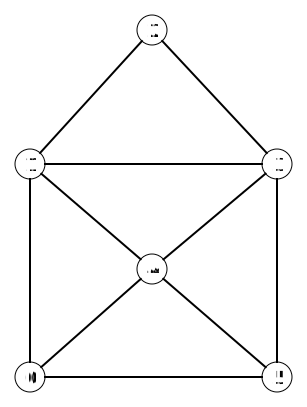

# Representing a graph with a computer

There are different ways to represent a graph. One of those ways is the adjacency list. Here you can see how to create such a list.

## Representing the nodes

The graph for the drawing of the little house looks like this.

We can visually see where each node is located and which other nodes it is connected to. The computer, however, cannot "see" this. Therefore, we need to come up with a way to refer to the nodes and edges of the graph. We do this by giving the nodes a number. Here you can see an example of how you can number the nodes of our graph. You choose yourself which node gets which number. Usually, we start numbering from 0.

## Representing the edges

Each node now has a number. We can use these numbers to also represent the edges of the graph. For that, we use an adjacency list. In this list, for each node we keep track of which other nodes it is connected to. For each node in our graph, we add a row to our list. In that row, we note which nodes this node is connected to. Below you can see an example of such an adjacency list.
| Number of the node | Numbers of the nodes to which the node is connected by an edge |
| - | - |
| 0 | 1, 4, 5 |
| 1 | 0, 2, 3, 4 |
| 2 | 1, 3 |
| 3 | 1, 2, 4, 5 |
| 4 | 0, 1, 3, 5 |
| 5 | 0, 3, 4 |

**Assignment**: Check the table above based on the figure of the graph. For each node in the left column, look at which nodes it is connected to. Does that match what you see in the table?