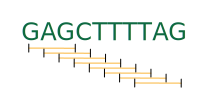
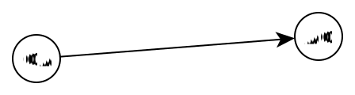
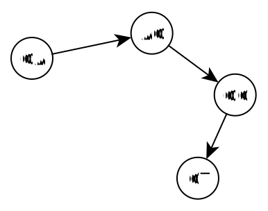
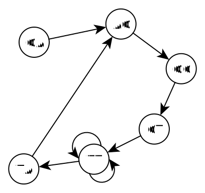
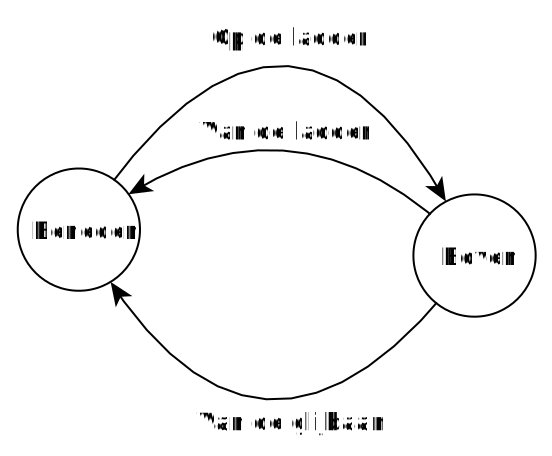

# The "De Bruijn" graph

To reconstruct the complete DNA strand based on the pieces of DNA that are the result of shotgun sequencing, you can use a De Bruijn graph. 

Before we construct such a graph, we first convert our pieces of DNA into a list of overlapping **k-mers**. A **k-mer** is a piece of DNA k nucleotides long. If k is 3, for example, then we make a list with pieces of DNA 3 nucleotides long (3-mers).

Taking the sequence GAGCTTTTAG as an example, we can convert it into 8 overlapping 3-mers: GAG, AGC, GCT, CTT, TTT, TTT, TTA, and TAG. 

Based on these k-mers we build the De Bruijn graph. For that, we take each k-mer, add the prefix of length k-1 as a node to the graph, add the suffix of length k-1 as a node to the graph, and connect them with an edge.

For GAG this yields the following graph:

In this way we add each k-mer to the graph. 

AGC

GCT

CTT

TTT

TTT

TTA

TAG

We add not only the k-mers for this one subsequence (GAGCTTTTAG), but also for all the other subsequences that we have read with shotgun sequencing. By adding enough pieces of DNA to the graph, you obtain a graph that represents the structure of the entire genome. 

<h2 class="title">Directed graphs</h2>

In the Königsberg graph, the edges between the nodes had no direction. For that problem it did not matter in which direction you crossed the bridge; both directions were possible. For some problems, however, it is necessary that you can traverse the edge in only one direction. Think, for example, of a slide. Via the stairs you can go up and back down, but via the slide itself you can in principle only go down. So the stairs have two directions, the slide only one. Below you see a graph that represents the possible ways to get onto and off a slide.

</img>

