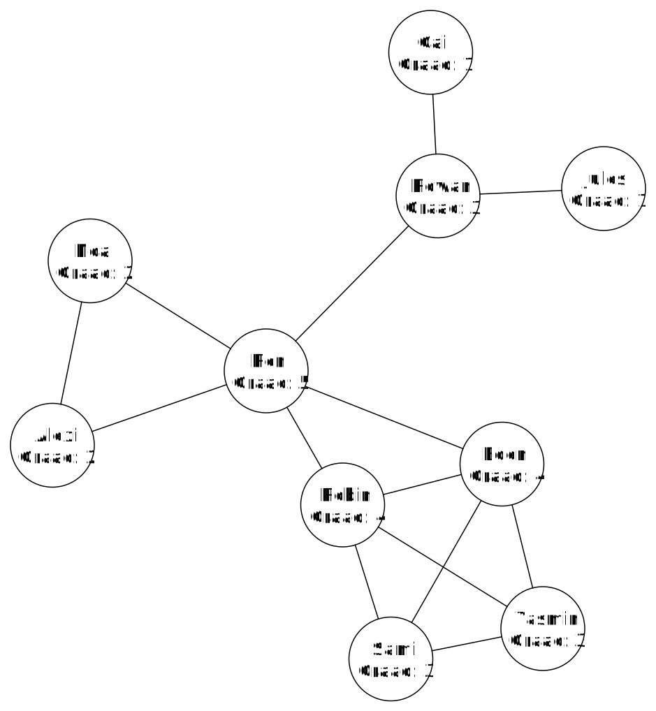

# Influencers

There are various measures to determine who has more or less influence within a social network. A simple method is to look at the number of connections a person has with others. If they have many connections, then they are more influential. 

## Degree centrality

The amount of influence a person has in a network is called that person's centrality. The word refers to how "central" a person is within the network. There are different ways to determine centrality. One of those ways is degree centrality. The degree centrality of a node is equal to the number of edges that leave that node (the degree of that node). Below you can see the degree of each node in our small social network.

If we want to know who has the most influence within our social network, we look at which node has the highest degree. In this case, that's Ren. Does this match your idea of who the most influential person is within the network?

<h2 class="title">Eigenvector centrality</h2>

Besides degree centrality, there are many other ways to determine a person's centrality. One such method is eigenvector centrality. Eigenvector centrality looks not only at how many connections a person has, but also at how valuable these connections are. If you're friends with people who themselves have many friends, you'll have more influence than if you're friends with "unpopular" people with few friends.

Your own influence in this case depends on the influence of the people you are connected to. Note that the influence of the people you are connected to also depends on your own influence. This is an example of an eigenvalue problem. Many problems fall under the category of eigenvalue problems. Think, for example, of Google PageRank. This is the algorithm Google uses to rank websites on the internet according to their importance. 

