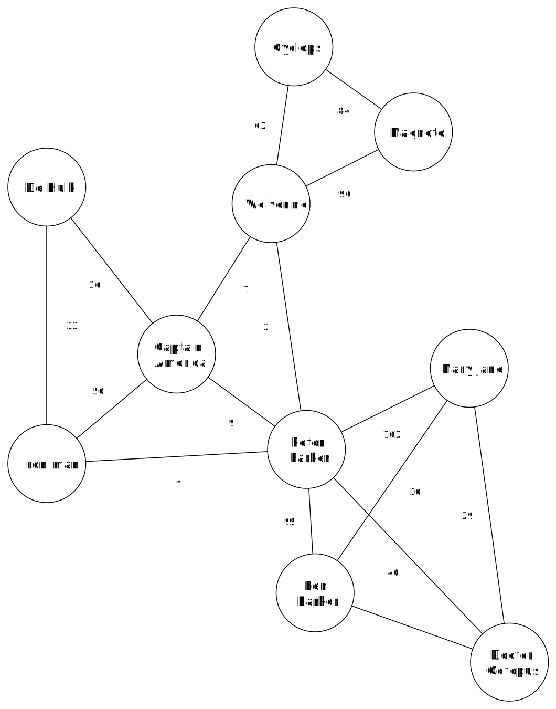

# The super social network

In the following notebook, you will explore a "super" social network yourself. The network contains an overview of all superheroes who have ever been part of a Marvel comic. In the network, there is a link between two characters when they have appeared together in a comic. If those characters appear together in multiple comics, that link receives a stronger weight. Below you can see an example of what a simple version of the super social network might look like.

The nodes of this graph represent the superheroes. When there is an edge between two heroes, they appear together in a comic one or more times. The number next to the edge indicates in how many comics they appear together. 

<h2 class="title">Assignment</h2>

Look at the image of the super social network. Think about how you would detect communities in this graph. Which properties will you take into account?

Now get started yourself with the social network of the Marvel superheroes and discover what information you can extract from the network.

