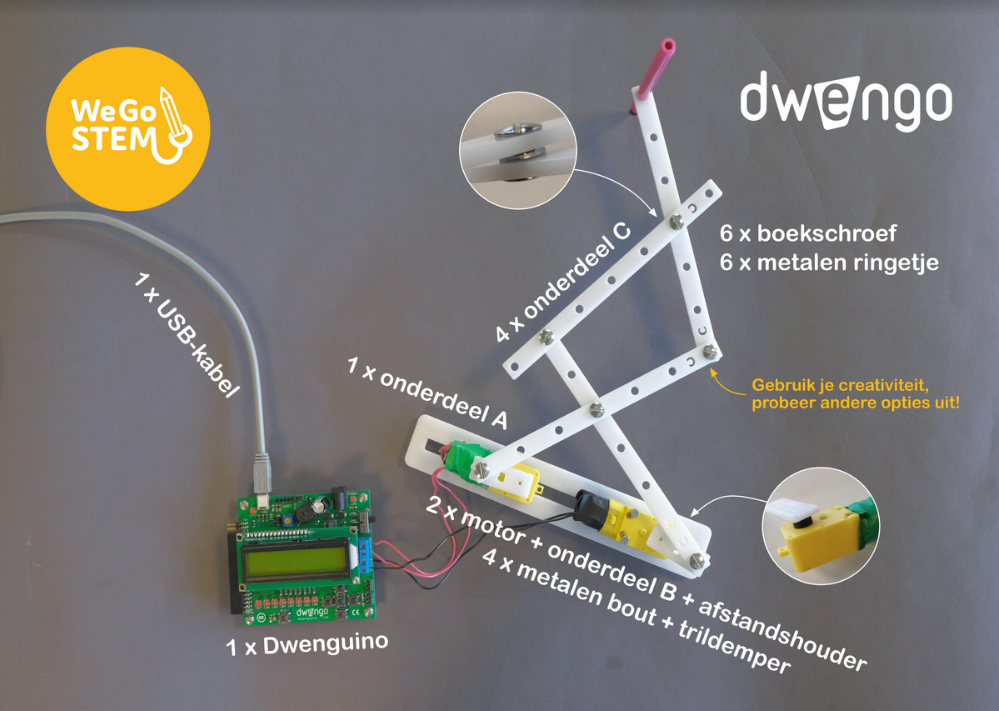

# Bouwen van een Tekenrobot

Nu je een idee hebt van hoe een robot werkt, kan je beginnen aan het bouwen van de robot zelf! Gebruik hiervoor de [foto](images/Voorbeeld.pdf "afgewerkte robot") en de onderdelen uit het doosje.

Slaag jij erin om de robot helemaal te bouwen, enkel en alleen door naar de foto te kijken? Heb je nog wat extra hulp nodig? Bekijk dan onderstaand filmpje.

