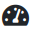

# dwenguinoBlockly  
## A programming environment

The programming environment with simulator is available online at [https://blockly.dwengo.org](https://blockly.dwengo.org "simulator link").

Below you see a screenshot of the environment with a description of the different parts.

1. **Toolbox** In this menu you can find the different code blocks. The menu is divided into categories, each containing a specific type of blocks. In  you can, for example, find all blocks that are specific to the dwenguino.

2. **Code area** This is where the program you create resides. The *'set up/repeat' block* is already there.   

> Only code placed in the ‘set up’ and 'repeat' sections of this block is executed. Code elsewhere is not executed. To program, drag blocks from the *toolbox* to the *code area* and snap them into the *‘set up/repeat’ block*. 

3. **Main menu** This menu lets you perform actions such as saving your code (with ), loading it again (with ), or opening and closing the simulation environment (with ).

4. **Simulator menu** Here you’ll find the buttons to start and stop the simulation with the buttons  and .   It also allows you to choose a specific scenario within which you want to run the code. In the example, the drawing robot (spirograph) scenario is selected. You can recognize this by the icon .

5. **Simulator window** In this window you see a virtual robot and often also a virtual microcontroller board, the dwenguino, or components with which you can test the code. Because the drawing robot scenario is selected in the image, you see a drawing robot with a dwenguino at the top right.

In the <em>toolbox</em> you can find the blocks you need to create programs. You must drag these blocks out of it and then snap them together in the desired order in the <em>code area</em>.

