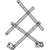

# dwenguinoBlockly  
## A programming environment

The programming environment with a simulator is available online at [https://blockly.dwengo.org](https://blockly.dwengo.org/?lang=en "link simulator").

Below you can see a screenshot of the environment with a description of the different parts.

1. **Toolbox** In this menu you can find the different code blocks. The menu is divided into categories, each containing a specific type of blocks. In , for example, you can find all the blocks that are specific to the dwenguino.

2. **Code field** This is where your program is displayed. The *'setup/loop'* block is already present.   

> Only code placed in the ‘setup’ and 'loop' parts of this block will be executed. Code placed elsewhere will not be executed. To program, drag blocks from the *toolbox* to the *code field* and click them into the *'setup/loop'* block.

3. **Main menu** With this menu you can perform actions such as saving your code (with ), loading code (with ), or opening and closing the simulation environment (with ).

4. **Simulation menu** Here you can find the buttons to start and stop the simulation with the buttons  and .   It also allows you to choose a specific scenario within which to run the code. In the example, the scenario of the drawing robot (spirograph) is selected. You can recognize this by the icon .

5. **Simulation window** In this window you can see a virtual robot and often also a virtual microcontroller board, the dwenguino, or components with which you can test your code. Because the drawing robot scenario is selected in the image, you can see a drawing robot with a dwenguino in the top right corner. 

So, in the <em>toolbox</em> you can find the blocks you need to create programs. You need to drag these blocks from the toolbox and then click them into the desired order in the <em>code field</em>.

