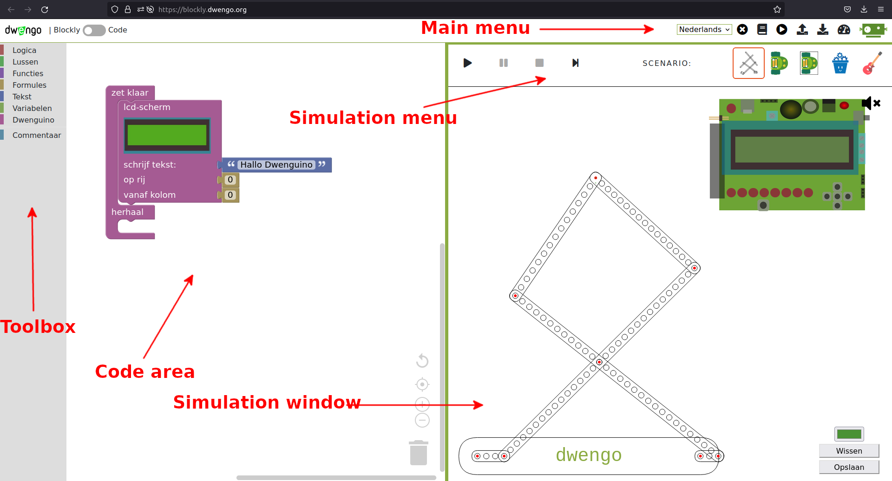
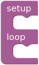
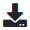

# DwenguinoBlockly
## A programming environment

The programming environment with simulator is available online at [https://blockly.dwengo.org](https://blockly.dwengo.org "simulator link").

Below you will see a screenshot of the environment with a description of the different components.

1. **Toolbox**  In this menu you can find the different code blocks. The menu is divided into categories, each containing a specific type of blocks. In , for example, you can find all the blocks related to input.

2. **Code area**  This is where your program is located. The *'setup/loop' block* is already in place.   

> Only code placed in the 'setup/loop' part of this block will be executed. Code placed elsewhere will not be executed. To program, simply drag and drop blocks from the *toolbox* to the *code area* and snap them into place in the *'setup/loop'* block.

3. **Main menu**  With this menu you can perform actions such as saving your code (with ), loading code (with ), or opening and closing the simulation environment (with ).

4. **Simulation menu**  Here you can find the buttons to start and stop the simulation with the buttons  and .    It also allows you to choose a specific scenario within which to run the code. In the example, the scenario of the social robot is selected. You can recognize this by the icon of the social robot .

5. **Simulation window**  In this window you will see a virtual robot and often a virtual microcontroller board, the Dwenguino, or components with which you can test the code. Because the scenario of the social robot is selected in the image, you can see various components at the top and a virtual social robot that you can program at the bottom. Please note that in order to simulate a program, you must first add the necessary components.

In the <em>toolbox</em>, you can find the blocks you need to create programs. You should drag these blocks out of the toolbox and then snap them into place in the desired order in the <em>code area</em>.

