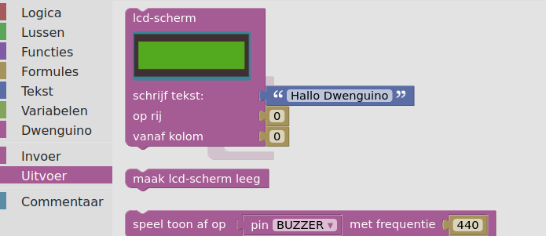
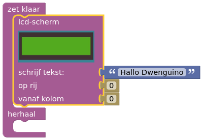
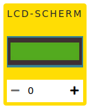

# dwenguinoBlockly
## Je eerste programma
Nu je weet wat waar staat, kan je beginnen te programmeren!

* Kies in het *simulatormenu* voor het scenario van de sociale robot .

* Ga in de *toolbox* naar de categorie  en zoek naar het *'lcd-scherm'-blok*:   

* Sleep dit blok naar het *codeveld* en klik het vast in het ‘zet klaar’-gedeelte van het *‘zet klaar/herhaal’-blok*:   

* Je schreef zonet je eerste programma!

* Voordat je het programma kan gaan testen, moet je de nodige componenten gaan toevoegen in het simulalatievenster. Om dit te doen, ga je in het simulatievenster op zoek naar het onderstaande icoon    en klik je op de +. Eens de component verschijnt, kan je deze verslepen naar de gewenste plaats op de doos.

* Voer dit programma uit met de simulator door in het *simulatormenu* te klikken op .

* Om de simulatie te stoppen, klik je in het *codeveld* of op .

Na deze oefening heb je de basis mee van hoe de omgeving werkt. Je kan blokken uit de <em>toolbox</em> nemen en deze aan een programma toevoegen in het <em>codeveld</em>. Je weet hoe je die code moet uitvoeren in de simulator en je kan in die simulator van scenario wisselen.

Eens een programma werkt in de simulator, kan je het ook uitproberen op een echte dwenguino! Hierna wordt uitgebreid beschreven hoe je een programma van de simulator kunt uploaden naar de dwenguino.

