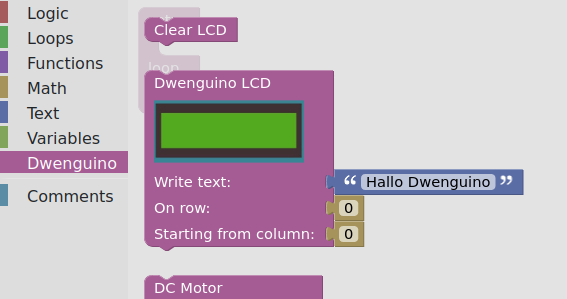
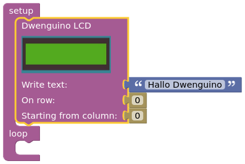

# DwenguinoBlockly
## Your first program
Now that you know where everything is, you can start programming!

* In the *simulator menu*, select the scenario for the drawing robot .

* In the *toolbox*, go to the category  and look for the *'lcd screen' block*:   

* Drag this block to the *code area* and snap it into the 'set up' section of the *'set up/repeat'* block:   

* You just wrote your first program!

* Run this program with the simulator by clicking on  in the *simulator menu*.

* To stop the simulation, click in the *code area* or on .

After this exercise, you have the basics of how the environment works. You can take blocks from the <em>toolbox</em> and add them to a program in the <em>code area</em>. You know how to execute that code in the simulator and you can switch scenarios in that simulator.

Once a program works in the simulator, you can also try it out on a real dwenguino! The next section describes in detail how to upload a program from the simulator to the dwenguino.

