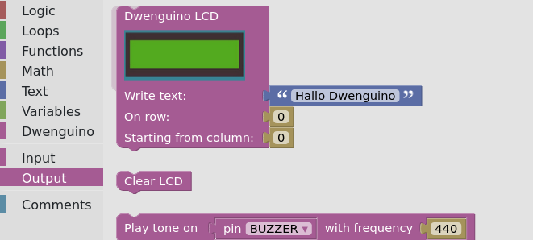
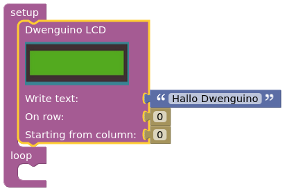
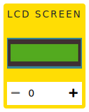

# DwenguinoBlockly
## Your first program
Now that you know where everything is, you can start programming!

* In the *simulator menu*, select the scenario of the social robot .

* In the *toolbox*, go to the category  and look for the *'LCD screen'-block*:   

* Drag this block to the *code field* and attach it to the ‘set up’ part of the *‘setup/loop’ block*:   

* You just wrote your first program!

* Before you can test the program, you need to add the necessary components to the simulation window. To do this, in the simulation window, look for the icon below and click on the + button.    Once the component appears, you can drag it to the desired location on the board.

* Run this program with the simulator by clicking on  in the *simulator menu*.

* To stop the simulation, click in the *code field* or on .

After this exercise, you have learned the basics of how the environment works. You can take blocks from the <em>toolbox</em> and add them to a program in the <em>code field</em>. You know how to execute that code in the simulator and you can switch between scenarios in that simulator.

Once a program works in the simulator, you can also try it out on a real dwenguino! Below is a detailed description of how to upload a program from the simulator to the dwenguino.

