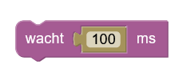

# dwenguinoBlockly
## Delay

The *'delay'-block* is an instruction that tells the computer how long something should be executed.

The time is expressed in milliseconds. One millisecond is one thousandth of a second. So in one second there are a thousand milliseconds.

**Example**

Try out the example below to see how it works!

