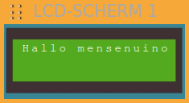

## Delay

EXERCISE 1

Write a program that does the following:

* Display "Hello people" on the LCD screen for 1 second (1000 ms).
* Display "I am dwenguino" on the LCD screen for 2 seconds (2000 ms).
* Repeat.

Solution:

The <em>'delay'</em> block that comes <strong>after</strong> a specific instruction, indicates how long the computer must <strong>delay</strong> the next instruction before it is initiated.

Note that you need to place the code in the <em>'loop'</em> part of the <em>'setup/loop'</em> block! 
The program only loops code that is in the <em>'loop'</em> part.

***

You will notice that the simulator alternates between "Hello people" and "I am dwenguino". However, this infinite loop causes a new problem:

This problem is caused by the fact that the LCD screen does not refresh all characters, but only the ones that change.

> H&nbsp;e&nbsp;l&nbsp;&nbsp;l&nbsp;o&nbsp;&nbsp;&nbsp;&nbsp;p&nbsp;e&nbsp;&nbsp;o&nbsp;p&nbsp;l&nbsp;e 
&nbsp;I&nbsp; &nbsp;&nbsp;&nbsp;&nbsp;a&nbsp;m&nbsp; &nbsp;&nbsp;&nbsp;&nbsp;D&nbsp;w&nbsp;e&nbsp;n&nbsp;g&nbsp;u&nbsp;i&nbsp;n&nbsp;o 
H&nbsp;e&nbsp;l&nbsp;&nbsp;l&nbsp;o&nbsp;&nbsp;&nbsp;&nbsp;p&nbsp;e&nbsp;&nbsp;o&nbsp;p&nbsp;l&nbsp;e&nbsp;n&nbsp;o&nbsp; 

To solve this, use the *'clear LCD screen'-block* to clear the LCD screen each time before new text appears:

