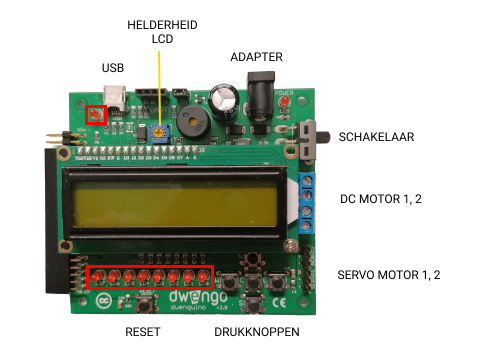

# DwenguinoBlockly
## LED

### Type
- Output
- Actuator

### Functioning
On the bottom left of the dwenguino board, you will find eight LEDs:

These LEDs are *LED 0*, *LED 1*, ..., *LED 7*, from right to left. The first LED is thus *LED 0*. In computer science, it is often convention to start counting from 0. You may have noticed this convention with the LCD screen as well.

On the top left there is another LED: *LED 13*.
This last LED has some special functionalities and therefore has a special name.

You can turn the LEDs on or off using the blocks provided for this purpose. You can find them under the category .