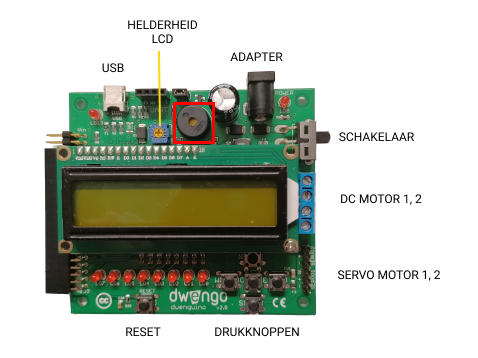

# dwenguinoBlockly
## Buzzer

### Type
- Output
- Actuator

### Operation
Above the LCD screen, you can see a round, black component. This is the buzzer. With it, you can play sounds.

Sound is a wave of air pressure caused by a vibrating object such as an instrument or speaker. The number of vibrations per second (the frequency) determines the pitch. When the number of vibrations per second is between 20 and 20,000, humans can hear it. We use the unit Hertz, abbreviated Hz, for vibrations per second. The human ear can hear vibrations between 20 Hz and 20,000 Hz.

To be able to play sound, the Dwenguino is equipped with a simple buzzer that you can play with a chosen frequency.

***

### In real life

### In the simulator

You can find the blocks you need to control the buzzer under the category .

For more information about the buzzer, you can consult the student sheets of the <em>Social Robot</em>

