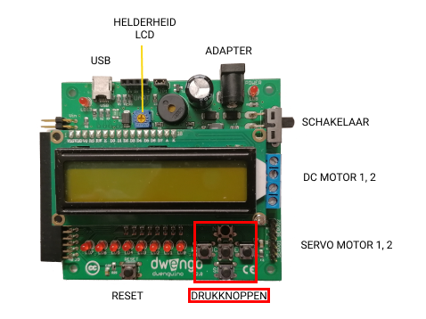
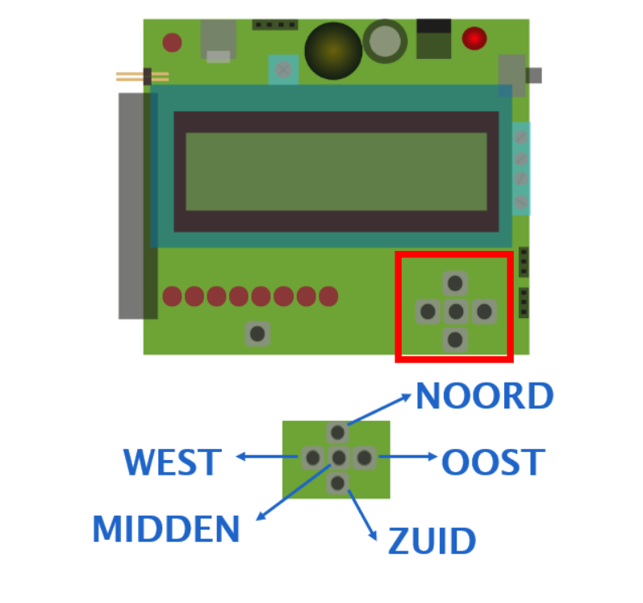

# dwenguinoBlockly
## Buttons

### Type
- Input

### How it works
On the dwenguino you will find five push buttons. The outer buttons are named NORTH, SOUTH, EAST, WEST, just like in geography. The middle button is called CENTER.

You can click a button with your mouse. If you click it, the button is pressed. When you release the button again, it is no longer pressed.  

***

### In real life

### In the simulator

The blocks needed to use the buttons can be found under the category .

*** 

Of course you want the drawing robot to start drawing only when you say so. Therefore, you will introduce an extra start condition here as in the example below:

