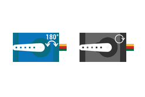
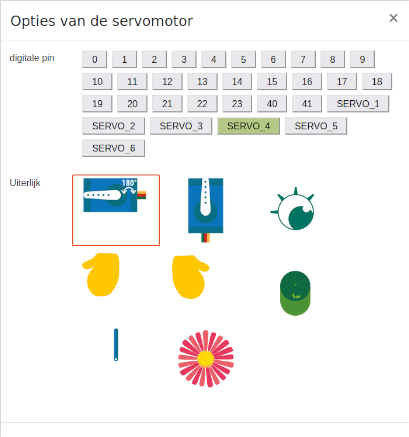

# DwenguinoBlockly

## Servo Motor

### Type
- Output
- Actuator

### Operation

You can use servo motors for anything: a moving hat, waving hands, eyebrows moving up and down... For moving arms and eyes, some blocks are already available in the simulator, but if you want, you can always program the servo motors yourself!

There are 2 types of servos available:
- *The blue servo motor*: This servo motor can only rotate 180 degrees. You can use it to perform a half-turn.
- *The black servo motor*: This servo motor can rotate 360 degrees. You can use it, for example, to rotate something constantly.

> The advantage of the blue servo motor compared to the black servo motor is that you can determine the position (the rotation angle) exactly. It is therefore better for precise movements. The disadvantage, on the other hand, is that it is a bit more complicated to program it manually. That's why some helper blocks have already been provided.

***

### In Real Life

### In the Simulator

To control the servo motors, numerous blocks have been provided which can be found under the category .

The servo motors can have a different appearance in the simulation window. You can do this by double-clicking on the component (after adding it to the simulation window). The following menu will appear:

Here you can choose a different appearance.

For more information about the servo motor, you can consult the student sheets of the <em>Social Robot</em>.

