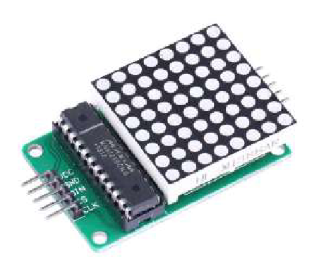

# DwenguinoBlockly
## LED Matrix

### Type
- Output
- Actuator

### Operation
The LED Matrix is a square 8x8 matrix with 64 LEDs in a fixed color (red). The matrix is ideal for lighting up certain patterns, such as an eye or a mouth of the robot or another symbol. You can also connect the matrices together (maximum of 4), if you want to use multiple matrices at the same time. You can program which LEDs should light up at the same time.

***

### In real life

### In the simulator

The blocks you need to program the LED matrices can be found under the category .

For more information about the LED Matrix, you can consult the student sheets of the <em>Social Robot</em>.

