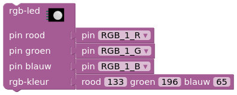

# dwenguinoBlockly
## RGB-led

### Type
- Uitvoer
- Digitale Actuator

### Werking
De RGB-led is een led waarvan je de kleur van het licht zelf kan bepalen door de intensiteit van rood, groen en blauw licht (de primaire kleuren) te programmeren. De intensiteit wordt doorgegeven als een getal tussen 0 en 255 (van lage tot hoge intensiteit). Houd er rekening mee dat niet alle kleuren even goed kunnen wordenweergegeven op de RGB-led via het RGB-kleurenmodel (bv. bruin).

***

### In het echt

### In de simulator

De blokken die je nodig hebt voor het programmeren van de led-matrices vind je terug onder de categorie .

### Belangrijke combinaties

|**Kleur**|**R (Rood)**|**G (Groen)**|**B (Blauw)**|
|---|---|---|---|
|Wit|255|255|255|
|Zwart|0|0|0|
|Rood|255|0|0|
|Groen|0|255|0|
|Blauw|0|0|255|

> Een <strong>kleurmengsysteem</strong> is een systeem gebaseerd op het idee dat je met een bepaalde set kleuren, <strong>primaire kleuren</strong> genoemd, alle andere kleuren kunt maken.  Het <strong>subtractieve kleurmengsysteem</strong> is het meest gekende, omdat kinderen dit zelf gemakkellijk kunnen ontdekken tijdens kleuren of verven. Rood + blauw = paars, blauw + geel = groen, geel + rood = oranje, ... Dit gaat uit van de primaire kleuren <strong>cyaan</strong> <em>(hemelsblauw)</em>, <strong>magenta</strong> <em>(een soort roze)</em> en <strong>geel</strong>.  Het <strong>additieve kleurmengsysteem</strong> is minder intuïtief. Dit wordt gebruikt bij het "mengen" van verschillende kleuren <strong>licht</strong>. De primaire kleuren zijn voor dit kleurmengsysteem <strong>rood</strong>, <strong>groen</strong> en <strong>blauw</strong>.

Voor meer informatie over de de RGB-led kan je terecht in de leerlingenfiches van de <em>Sociale Robot</em>.

