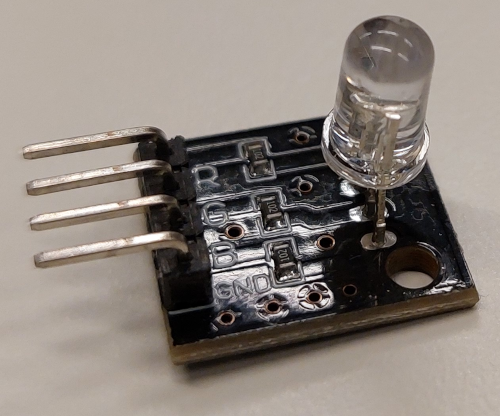

# dwenguinoBlockly
## RGB-led

### Type
- Output
- Digital Actuator

### Functioning
The RGB LED is a LED whose light color can be determined by programming the intensity of red, green, and blue light (the primary colors). The intensity is passed as a number between 0 and 255 (from low to high intensity). Keep in mind that not all colors can be displayed equally well on the RGB LED using the RGB color model (e.g. brown).

***

### In real life

### In the simulator

The blocks you need for programming the LED matrices can be found under the category .

### Important combinations

|**Color**|**R (Red)**|**G (Green)**|**B (Blue)**|
|---|---|---|---|
|White|255|255|255|
|Black|0|0|0|
|Red|255|0|0|
|Green|0|255|0|
|Blue|0|0|255|

> A <strong>color mixing system</strong> is a system based on the idea that with a certain set of colors, called <strong>primary colors</strong>, you can make all other colors.  The <strong>subtractive color mixing system</strong> is the most well-known because children can easily discover it themselves during coloring or painting. Red + blue = purple, blue + yellow = green, yellow + red = orange, ... This is based on the primary colors <strong>cyan</strong> <em>(sky blue)</em>, <strong>magenta</strong> <em>(a kind of pink)</em>, and <strong>yellow</strong>.  The <strong>additive color mixing system</strong> is less intuitive. This is used when "mixing" different colors of <strong>light</strong>. The primary colors for this color mixing system are <strong>red</strong>, <strong>green</strong>, and <strong>blue</strong>.

For more information about the RGB LED, you can consult the student sheets of the <em>Social Robot</em>.

