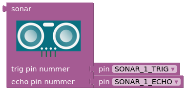
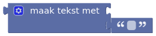
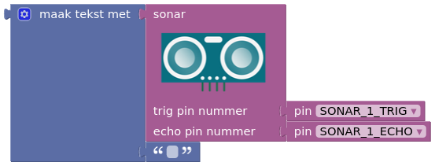
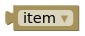
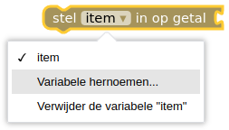
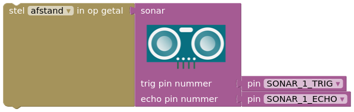

## Sonar sensor

EXERCISE 1

Before using the sonar sensor, you need to test it. Write a program to read the sonar sensor.

***

To read the sonar sensor (the distance measured by the sensor), you will use the LCD screen. The block of the sonar sensor simply represents a number that you can display on the screen.

For this, you need the following blocks:

When you combine these blocks, you get:

The number from the sonar sensor is converted by the  into data that can be displayed on the LCD screen.

With this new text block, you can now replace the existing *'text' block* of the LCD screen, resulting in the following program:

***

However, in more complicated programs, you will quickly find that it is very busy to use the *'sonar sensor'* block every time because it is quite large. To solve this and keep the program organized, you will use **variables**.

For this, you need the following blocks:

To improve the readability of your program, you should first rename the variable 'item' to something better. Since you are measuring distance here, you can use 'distance', for example. Use the help menu for this.

Once you have done this, you combine the *'sonar sensor'* block with the :

Once you have named a variable in a program, you can always call it using . *Make sure you call the correct variable!*

The end result for reading a sonar sensor looks like this:

The values returned by the sonar sensor are now displayed on the LCD screen. If it doesn't work, you need to troubleshoot to find the problem.
<ul>
<li>Is it the right program? (Check the code)</li>
<li>Is the sensor connected correctly? (Check the wiring)</li>
<li>Is the sensor working?</li>
</ul>

