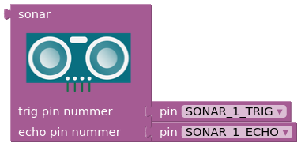
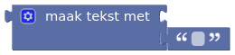
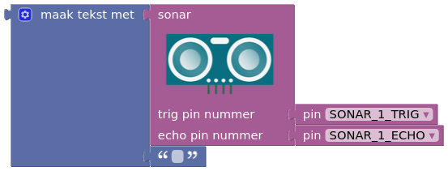
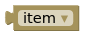
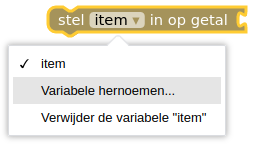
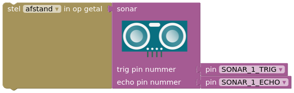

## Sonar sensor

EXERCISE 1

Before using the sonar sensor, you must first test it. Write a program to read the sonar sensor.

***

To read the sonar sensor (which measures distance), you use the LCD screen. The block of the sonar sensor simply represents a number that you can display on the screen.

To do this, you need the following blocks:

When you combine these blocks, you get this:

The number from the sonar sensor is converted by the  to data that you can display on the LCD screen.

You can now replace the existing *'text'* block of the LCD screen with this new text block, resulting in the following program:

***

However, in more complex programs, you will quickly notice that it is very crowded to use the *'sonar sensor'* block every time, as it is quite large. To remedy this and keep the program organized, you will use **variables**.

For this, you need the following blocks:

To improve the readability of your program, you should first rename the variable 'item' to something better. For example, since you are measuring distance here, you can use 'distance'. Use the help menu for this.

Once you have done this, combine the *'sonar sensor'* block with :

Once you have named a variable in a program, you can always call it using . *Make sure you specify the correct variable!*

The end result for reading a sonar sensor looks like this:

The values returned by the sonar sensor are now displayed on the LCD screen. If this doesn't work, troubleshoot to find the problem.
<ul>
<li>Is it the right program? (Check the code)</li>
<li>Is the sensor connected correctly? (Check the wiring)</li>
<li>Is the sensor working?</li>
</ul>

