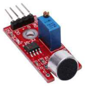

# dwenguinoBlockly
## Sound Sensor

### Type
- Input
- Digital sensor

### Operation
Use this sensor to detect sound. The sensor returns 1 when there is sound and 0 when it's silent. Ideally, this sensor should be used in a quiet environment.

### Working in the simulator
In the simulator, a button is provided to simulate sound. Pressing the button simulates sound. Programming of the sound sensor is similar to the programming of the sonar sensor.

***

### In real life

### In the simulator

You can find the necessary blocks for controlling the sound sensor under the category .