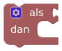
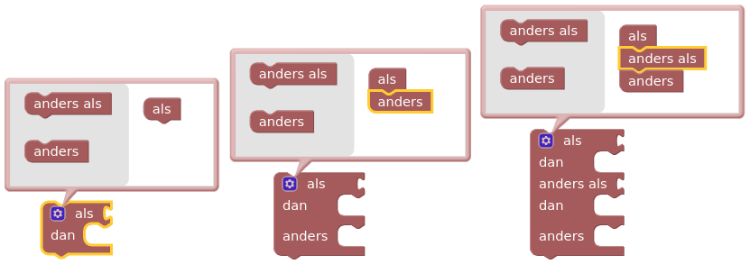
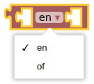
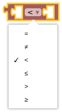

# dwenguinoBlockly
## Conditional Statements: If-Then

To make your robot a social robot, it will need to be able to react to certain stimuli: a person approaching, a loud noise, etc. Think, for example, of sliding doors that open when someone is nearby.

To let your robot respond to such stimuli, you use a conditional statement. Conditional statements always consist of a **condition**, *IF*, and an associated **action**, *THEN*. Often, an **alternative action**, *ELSE*, is also provided, which is executed if the condition is not met.

***

In the simulator, you can find the blocks for a conditional statement in the category . The simplest form of this block is the *'IF-THEN'* block.

However, you can make this block as long as you want, depending on the number of conditions your robot has to take into account. How to do this is briefly shown below.

As mentioned earlier, you can make this block as long as you want, but be careful not to make your program unnecessarily complicated!

***

To program conditions for a conditional statement, you use the blocks below:

When you combine these, you can program very simple conditions such as *"if the distance is greater than 0, but less than 20, then ..."* 

