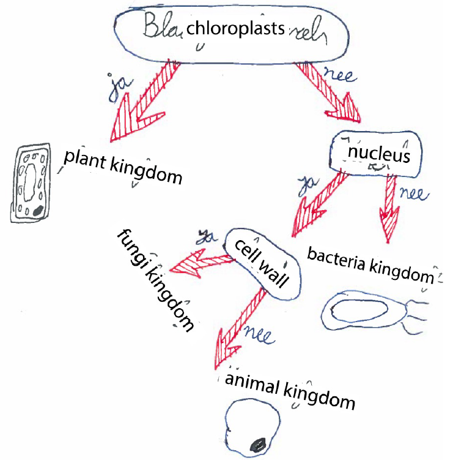

# Arbre de décision pour déterminer le type de cellule

Dans cette étude de cas, vos élèves vont se mettre au travail pour créer un arbre de décision qui, à partir d’une cellule, détermine s’il s’agit d’une bactérie, d’un champignon, d’une plante ou d’un animal. Lors de la conception de l’arbre, les élèves doivent décomposer une tâche complexe en différentes sous-tâches.

**Public cible :** premier degré, filière A

**Cours :** ...

**Prérequis :** les élèves ont des connaissances de base sur les cellules

Un déroulement possible de l’étude de cas est le suivant :
<ol>
    <li>Vous expliquez aux élèves ce que sont les arbres de décision et comment les représenter.
    <li>Les élèves reçoivent la consigne de réaliser un arbre de décision afin de déterminer, à partir d’une cellule, s’il s’agit d’une bactérie, d’un champignon, d’une plante ou d’un animal.
    <li>Les élèves évaluent l’arbre de décision d’un camarade selon des critères prédéfinis (contenu, classification, visualisation).
    <li>Ils utilisent les retours pour produire une seconde version de leur arbre de décision.
</ol>

Un exemple d’un arbre de décision réalisé par l’un des élèves dans l’étude de Nijenhuis-Voogt et al. (2022)