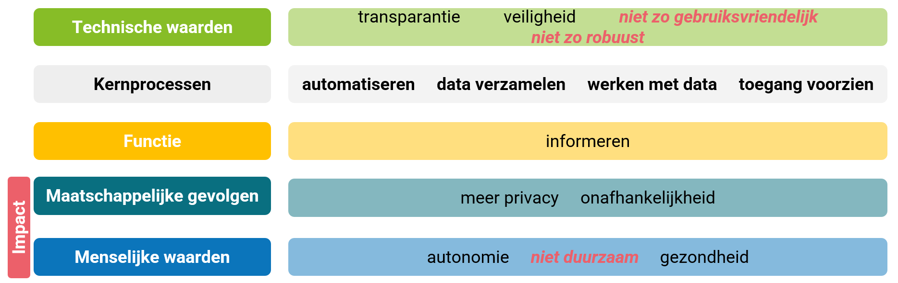

# Test de grossesse

Sur le marché, on trouve des tests de grossesse sous forme non numérique et numérique. Les fabricants de tests de grossesse comptent peut-être sur le fait que les gens supposent qu’une version numérique du test de grossesse est meilleure qu’une version non numérique. En proposant une version numérique, ils augmentent potentiellement leur marge bénéficiaire, car cette version numérique est nettement plus chère que le test de grossesse non numérique. 

**Impact: test de grossesse** 
Un impact possible est que les gens dépensent plus d’argent que nécessaire.

Mais pour pouvoir conclure cela, il est préférable de comparer le fonctionnement des deux systèmes afin de déterminer si l’un présente plus d’avantages ou d’inconvénients que l’autre. 

## Principes de la pensée computationnelle

## Cadre de l'impact sur la société

## Discussion de l'impact

- En raison de l’électronique que contient l’appareil numérique, il est moins robuste et, par conséquent, moins facile à utiliser. Il faut veiller à ce qu’aucune humidité n’atteigne le microcontrôleur, sinon l’appareil tombera en panne.
- En raison du texte affiché à l’écran, il est d’une part plus adapté aux personnes qui ont des difficultés avec l’abstraction (interpréter « une barre » par opposition à « deux barres »), mais d’autre part moins adapté aux personnes qui lisent mal ou ne maîtrisent pas la langue d’une région donnée.
- Le fait de pouvoir réaliser soi-même un tel test, donc sans consulter un médecin, le rend accessible aux personnes qui ne souhaitent pas ou n’osent pas aller chez le médecin. Le test favorise donc l’indépendance et une plus grande confidentialité et permet de diffuser certaines informations auprès d’un plus grand nombre de personnes.
- Les valeurs humaines associées ici sont l’autonomie et la santé. Mais cela vaut tout autant pour la version non numérique du test.
- En raison des déchets électroniques et de la pile que laisse la version numérique, celle-ci a un impact supplémentaire sur l’environnement et est donc moins durable que la version non numérique.