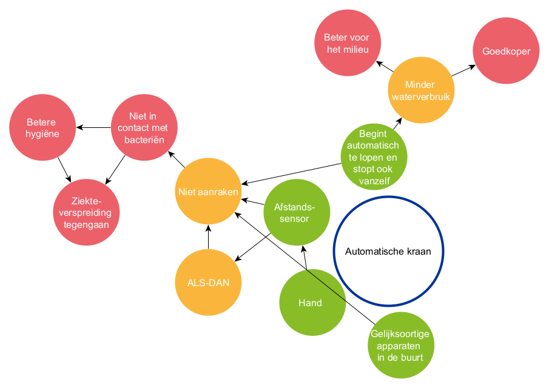
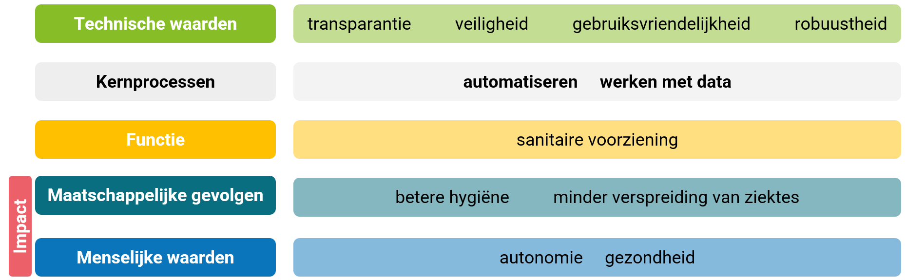

# Robinet automatique

Un robinet automatique est un système numérique très simple, avec lequel les élèves entrent eux-mêmes régulièrement en contact. L'impact sur la société se situe dans l'influence positive sur l'hygiène, la propagation des maladies ou la réduction de la consommation d'eau.

## Principes de la pensée computationnelle

## Cadre de l'impact sur la société

## Discussion de l'impact
- Ces appareils sont faciles à utiliser. Grâce à leur convivialité, ils sont beaucoup utilisés, ce qui peut amplifier leur impact. Comme il n'est pas nécessaire de les toucher, ils empêchent les utilisateurs d'être contaminés par des virus ou des bactéries et peuvent contribuer à freiner la propagation des maladies au sein de la population.
- Le monde « réel » est complexe. Même cet exemple simple l'illustre. Ces robinets automatiques peuvent être sensibles à une contamination par la bactérie Legionella. Comme l'eau coule souvent pendant de courtes périodes, la bactérie a davantage de chances de se multiplier. Mais des solutions technologiques existent déjà pour cela, comme un rinçage automatique à intervalles réguliers. Lors de la discussion finale, concentrez-vous sur l'interaction entre le domaine des sciences et la société.
- Bien que ces systèmes soient parfois qualifiés d'« intelligents », ils ne font pas appel à l'IA. En prendre conscience fait aussi partie de la littératie en IA et d'une approche critique de l'information.

-------------------------------
## Exemples connexes: 

- Les portes coulissantes automatiques, l'éclairage qui s'allume automatiquement lorsqu'un mouvement est détecté, le signal sonore activé lors de l'utilisation des capteurs de stationnement d'une voiture, les barrières automatiques... fonctionnent de manière similaire. Vous pouvez, par exemple, demander à vos élèves d'analyser l'un de ces exemples pour une évaluation sommative.
- Mettez vos élèves au défi ! Les exemples suivants présentent-ils des similitudes avec le système numérique de cette étude de cas ou non ?
    - Exemple 1 : Le matou de Marie-Thérèse est pucé, de sorte que la chatière s'ouvre automatiquement lorsqu'elle n'est pas à la maison, et uniquement pour lui.
    - Exemple 2 : L'ancienne maison d'un célèbre peintre décédé est ouverte au public. Afin d'empêcher l'accès à certaines parties de la maison, l'entrée de certaines pièces est sécurisée par un système de faisceaux laser.