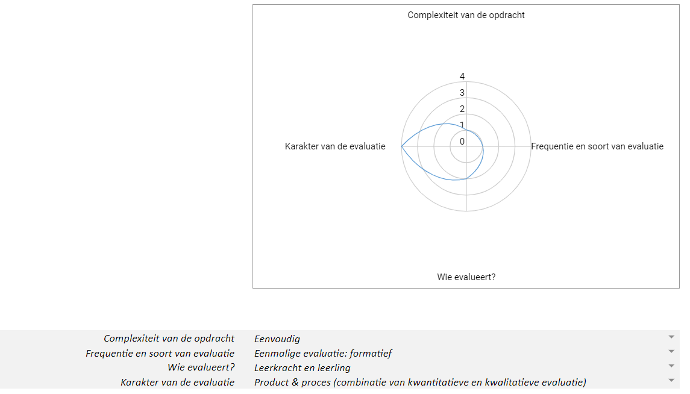

# Évaluer
## Évaluer l'activité d'apprentissage suivante : Explorer le kit de construction du robot social

**Objectif pédagogique/objectif du programme :** 
Les élèves distinguent les éléments constitutifs des systèmes numériques et expliquent comment ceux-ci collaborent pour faire fonctionner le système.

**Concepts :**
* Décomposition : identifier les composants + distinction électronique/non électronique
* Reconnaissance de motifs : reconnaître l'entrée, le traitement, la sortie et le transport
* Abstraction : ignorer les composants non électroniques
* Compréhension du numérique : expliquer le fonctionnement d'un système numérique

**Objectifs d'apprentissage :**
* Les élèves identifient chaque composant du kit de construction et distinguent l'électronique du non électronique. (Comprendre)
* Les élèves se concentrent sur les composants électroniques et ignorent les composants non électroniques. (Appliquer)
* Les élèves reconnaissent quels composants électroniques sont responsables de l'entrée, du traitement, de la sortie et du transport. (Comprendre)
* Les élèves relient entre eux des composants électroniques de leur choix. (Appliquer)
* Les élèves expliquent comment le système numérique peut fonctionner. (Comprendre)

**Tâches des élèves :**
* Les élèves classent les composants du kit de construction en électronique et non électronique.
* Les élèves utilisent les fiches élèves pour nommer chaque composant électronique du kit de construction.
* Les élèves classent les composants électroniques selon l'entrée, le traitement, la sortie et le transport.
* Les élèves utilisent les fiches élèves pour connecter des composants électroniques au Dwenguino.
* Les élèves expliquent comment leur système numérique peut fonctionner. Ils choisissent eux-mêmes comment l'expliquer via un dessin, un texte, une vidéo ...

**Approche d'évaluation :** 
