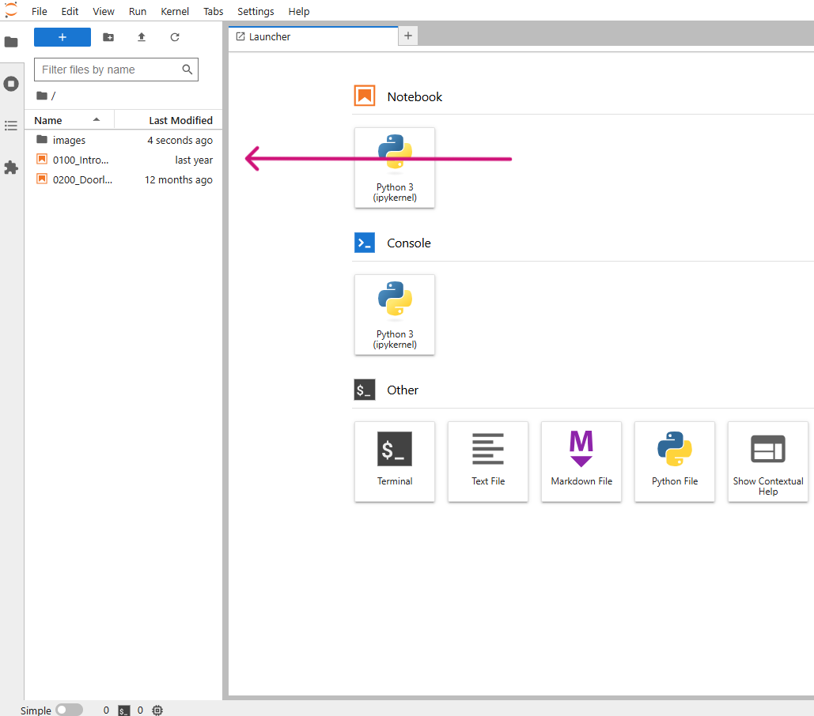

# Travailler avec des notebooks

Le matériel de cours de « Python en mathématiques et STEM » est proposé sous la forme de **_notebooks_** interactifs. Les notebooks sont des _documents numériques_ qui contiennent à la fois du code exécutable ainsi que du texte, des images, des vidéos, des hyperliens ...

Les _nouveaux concepts_ sont introduits via des explications textuelles, des vidéos et des images.

Il existe des *exemples* élaborés ainsi que des *exercices* de petite et de grande ampleur. Dans ces exercices, tu pourras exécuter le code fourni, mais aussi écrire ton propre code.

Le code utilisé dans les notebooks est en Python version 3. Nous avons choisi Python parce que c’est un langage de programmation très accessible, souvent également intuitif.  
De plus, Python est en plein essor et est utilisé par des entreprises telles que Google, la NASA, Netflix, Uber, AstraZeneca, Barco, Instagram et YouTube.

Nous avons opté pour les notebooks car ils présentent plusieurs avantages importants : les enseignants n’ont pas besoin d’installations avancées pour les utiliser ; les enseignants peuvent proposer différents types de contenus de cours via une seule plateforme ; les notebooks sont interactifs ; les élèves construisent pas à pas la solution d’un problème dans le notebook, ce qui rend ce processus visible pour l’enseignant ([Jeroen Van der Hooft, 2023](https://libstore.ugent.be/fulltxt/RUG01/003/151/437/RUG01-003151437_2023_0001_AC.pdf)).    

---
Si tu cliques sur le bouton ci-dessous 'Ouvrir les notebooks', tu seras redirigé vers un autre site où tes notebooks personnels seront chargés. (Cela peut prendre un moment.)

Une fois tout chargé, tu arrives dans Jupyter Lab et tu trouveras à gauche de l’écran deux fichiers (orange) avec l’extension _.ipynb_.
Ce sont les deux notebooks qui te donnent respectivement un aperçu de la structure et des possibilités, et expliquent comment les prendre en main.
Tu y verras aussi un dossier *images*. Ce dossier contient les images affichées dans les notebooks.

Pour ouvrir un fichier ou un dossier, double-clique sur le nom du fichier/dossier.

Dans ces deux premiers notebooks, tu apprends comment les notebooks sont conçus et comment les utiliser. 
Après avoir parcouru les deux notebooks, tu auras une bonne idée de la manière dont nos notebooks Python sont structurés.

