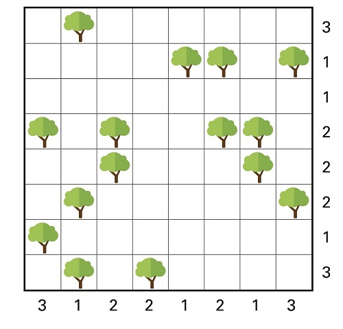

# Puzzel Tentje-boompje

### Probleemstelling
- Bekijk het gegeven veld met bomen.
- Onder, naast of boven elke boom komt er een tent te staan. Meerdere tenten per boom zijn toegestaan. 
De velden van de tenten mogen elkaar niet raken, ook niet diagonaal.
- Bij elke rij en kolom staat gegeven hoeveel tenten er in die rij of kolom moeten staan. 

<figure>
    <figcaption align = "center">Afbeelding gebruikt op basis van citaatrecht. Bron: Het Nieuwsblad - NU, 21 oktober 2023.</figcaption>
</figure>