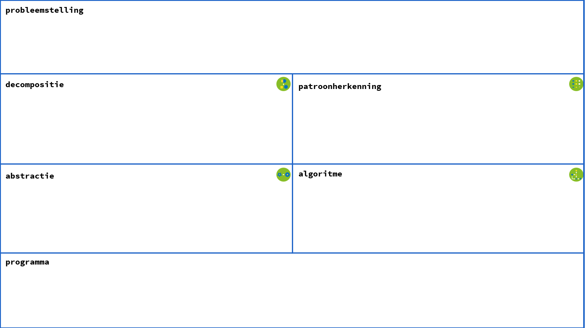

# Puzzel Tentje-boompje

### Opdracht
- Schrijf in de notebook een programma dat deze puzzel voor jou oplost.
- Omschrijf hoe je hierbij **principes van computationeel denken** hebt aangewend. Je kan daarvoor eventueel het onderstaande schema gebruiken. Je werkwijze moet duidelijk zichtbaar zijn in de notebook.
- Test het programma uit.
- Wat is de oplossing van de puzzel?

  