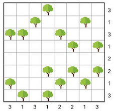
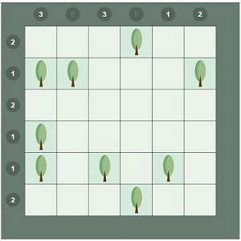
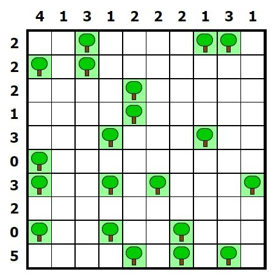

# Slot

Je kan je programma nu gebruiken om soortgelijke puzzels, bijvoorbeeld de onderstaande, op te lossen.

<figure>
    <figcaption align = "center">Afbeelding gebruikt op basis van citaatrecht. Bron: Het Nieuwsblad - NU, 14 oktober 2023.</figcaption>
</figure>

<figure>
    <figcaption align = "center">Afbeelding gebruikt op basis van citaatrecht. </figcaption>
</figure>

Bron: [Het Nieuwsblad Tentje-Boompje mini](https://www.nieuwsblad.be/tentjeboompjemini)

<figure>
    <figcaption align = "center">Afbeelding gebruikt op basis van citaatrecht. </figcaption>
</figure>

Bron: [puzzle-loop.com](https://nl.puzzle-tents.com/?size=4)
