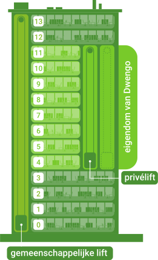

# De uitdaging
De kantoren van Dwengo bevinden zich op de vierde tot en met elfde verdieping van een kantoorgebouw. Er is een gedeelde lift voor alle bedrijven in dit gebouw. Deze lift kan echter enkel gebruikt worden om zich van en naar de uitgang te verplaatsen en dus niet voor verplaatsingen tussen de verdiepingen. Hieronder zie je een tekening van hoe het kantoorgebouw eruitziet.

De werknemers van Dwengo kunnen zich tussen hun eigen verdiepingen verplaatsen met een privélift. Omdat het aantal werknemers de laatse jaren sterk is toegenomen, is de lift vaak overbelast. Om dat op te lossen, heeft Dwengo besloten om een extra privélift te laten installeren. Om deze efficiënt in te zetten, beslissen ze om ervoor te zorgen dat de twee liften een eigen verzameling van verdiepingen hebben waar ze stoppen. Bijvoorbeeld, de ene lift stopt enkel op de even verdiepingen en de andere lift enkel op de oneven verdiepingen. Merk op dat er hierdoor geen verplaatsingen met de lift meer mogelijk zijn tussen even en oneven verdiepingen. Deze mensen moeten de trap nemen.

Omdat er niet evenveel verplaatsingen zijn tussen de verschillende verdiepingen, wil Dwengo de opdeling zo kiezen dat er zo weinig mogelijk mensen de trap moeten nemen. Hieronder vind je een overzicht van de verplaatsingen die op een gemiddelde dag plaatsvinden.

| Van verdieping      | Naar verdieping |
| ----------- | ----------- |
| 4      | 8, 10, 10, 8, 6, 6        |
| 5   | 8, 8, 9, 9, 11, 11, 11, 9, 8         |
| 6   | 10, 8, 10, 4         |
| 7   | 10, 10, 11, 11, 11, 5, 11, 5, 9, 9, 5, 10, 10         |
| 8   | 5, 5, 4, 6, 4, 6, 5, 10, 10         |
| 9   | 5, 5, 11, 11, 7, 11, 7, 5         |
| 10   | 6, 8, 8, 7, 6, 7, 6         |
| 11   | 7, 5         |

Op welke verdiepingen moet elk van de liften stoppen om ervoor te zorgen dat er zo weinig mogelijk mensen de trap moeten nemen? De twee liften stoppen elk op hun eigen vier verdiepingen, deze verzamelingen overlappen niet.

