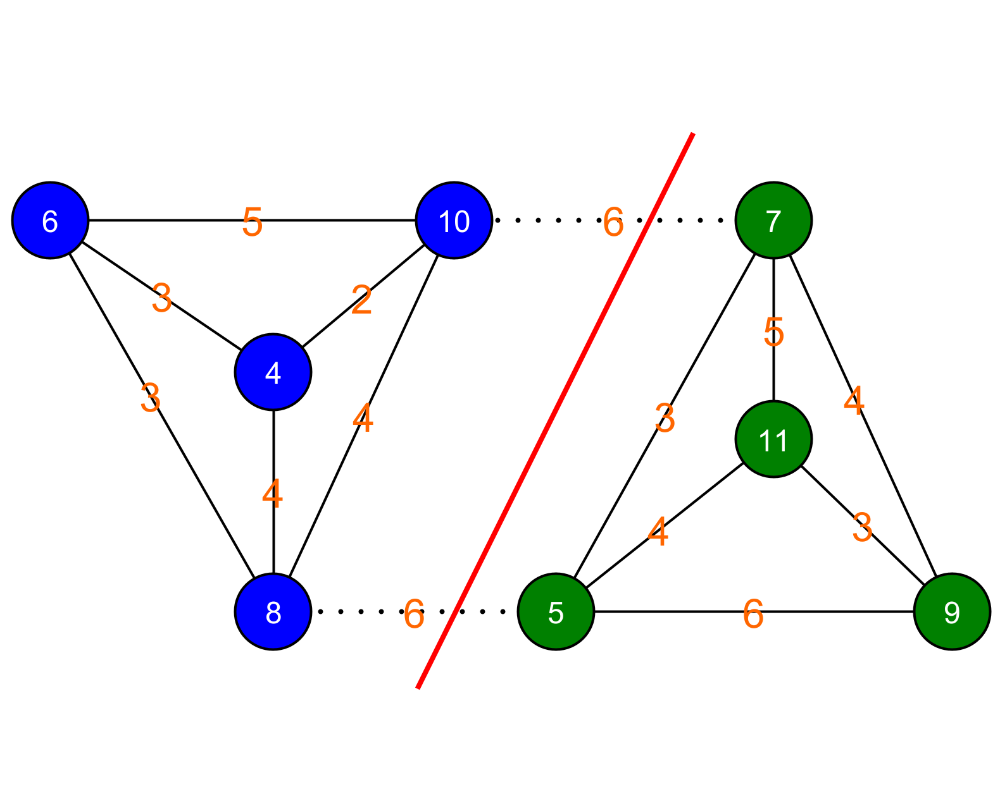

# Grafische oplossing

Door de graaf te tekenen en met de knopen te schuiven, kunnen we ook een oplossing bekomen. Hieronder zie je de graaf waarop we even (blauw) en oneven (groen) verdiepingen elk een eigen label gegeven hebben. Het is in deze voorstelling niet onmiddellijk duidelijk hoe we de graaf in twee moeten knippen. We kunnen de knopen echter verplaatsen om zo een duidelijker beeld te krijgen van hoe de graaf geknipt kan worden.

Hieronder zien we dat we door de graaf te herstructureren wel een duidelijk beeld kunnen krijgen van hoe de knip kan gebeuren. 

Zo zien we ook duidelijk dat de minimale knip kost gelijk is aan twaalf.

In deze specifieke graaf kunnen we ook zien dat dit de beste knip is, aangezien we om gelijk welke node te wisselen tussen de groepen altijd een hogere knipkost krijgen.

De brute kracht methode kan je vaak als eerste optie gebruiken om een probleem computationeel op te lossen. In ons geval, omdat de graaf waarop we werken klein is, lukt dit nog. Ons algoritme neemt echter exponentieel toe in complexiteit als het aantal knopen stijgt (\\(O(n!)\\)). Merk op dat er bij een graaf van 20 knopen al 184 756 mogelijke verdelingen van de graaf zijn. Bij een graaf met 30 knopen is dat 155 117 520 en bij 40 knopen 137 846 528 820. Het aantal nodige berekeningen stijgt dus exponentieel met het aantal knopen. 

De hoeveelheid rekenkracht die nodig is om een probleem op te lossen, drukken computerwetenschappers vaak uit in functie van de grootte van de invoer. Deze hoeveelheid rekenkracht wordt ook wel de <strong>complexiteit</strong> van het algoritme genoemd. Stel dat de grootte van de invoer gelijk is aan \(n\) dan drukken we de complexiteit uit in functie van die \(n\). Als er \(n\) bewerkingen nodig zijn om de oplossing te berekenen, dan zeggen we dat het algoritme een complexiteit heeft van \(O(n)\). Er zijn dus maximum grootteorde \(n\) bewerkingen nodig om tot een oplossing te komen. Voor het graaf-knip probleem is de complexiteit \(O(n!)\). Bijgevolg groeit de complexiteit veel sneller dan de grootte van de invoer. Hierdoor zal het al voor relatief kleine waarden van n, moeilijk zijn om de oplossing uit te rekenen. 

Helaas is dit een probleem dat in de categorie valt van de NP-complete problemen. Dat zijn problemen waarvoor geen algoritme bestaat dat het probleem in polynomiale tijd (\\(O(n^x)\\) met \\(x\\) een constante) kan oplossen. Heel moeilijke computationele problemen dus. Omdat het zoeken van de minimale knip van een graaf een veelvoorkomend probleem is in de informaticawetenschappen, zijn er verschillende algoritmes die op een snelle manier tot een oplossing kunnen komen. Deze algoritmes garanderen echter niet dat het resultaat dat ze geven effectief de beste oplossing is. Deze zijn gebaseerd op de filosofie dat een suboptimale oplossing in weinig tijd beter is dan de perfecte oplossing waar heel veel tijd voor nodig is om die te berekenen. Hierna bekijken we een aantal van die algoritmes.
