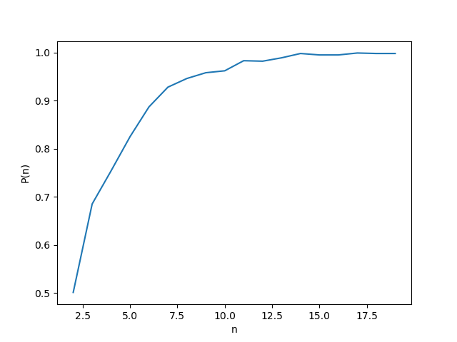

# Monte Carlo

## Algoritme van Karger: kans op juiste gok

Omdat we het antwoord kennen voor onze graaf, kunnen we de kans berekenen dat we een correct antwoord hebben na \\(n\\) keer gokken. 


```python

# Determine the probability of getting a correct answer using the minCutRepeat function for n = 8
def bepaalKansOpCorrectAntwoordVoorAantalGokken(n):
    aantal_correct = 0
    for i in range(1000):
        mincutcost, labels = herhaalGokDeKnipKost(bogen_matrix, n)
        if mincutcost == 12:
            aantal_correct += 1
    return aantal_correct/1000


probs = []
for tries in range(2, 20):
    probs.append(bepaalKansOpCorrectAntwoordVoorAantalGokken(tries))
 
print(probs)
 
plt.plot(range(2, 20), probs)
plt.show()

```

Op de grafiek hieronder zie je de kans op een correcte gok voor elke \\(n\\) van 2 tot 20.

