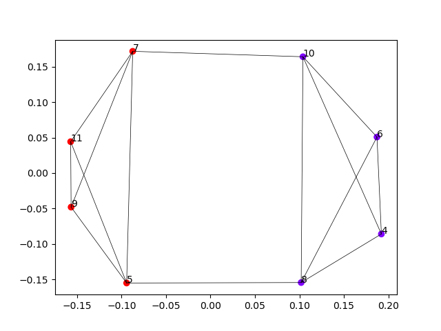

## Clusteren

We zagen reeds twee methodes om het raadsel op te lossen. Deze maakten telkens gebruik van een andere algoritmische techniek. Hier kijken we nog kort naar een derde techniek om het probleem op te lossen. Deze maakt gebruik van clustering. Meer informatie over clustering kan je vinden in het het [KIKS leerpad](https://dwengo.org/learning-path.html?hruid=kiks3_dl_basis&language=nl&te=true&source_page=%2Fkiks%2F&source_title=%20KIKS#kiks_stomata;nl;3). Daar wordt clustering gebruikt om voorspellingen die dicht bij elkaar liggen, samen te voegen. 

Clustering algoritmes worden gebruikt om groepen van items op basis van hun eigenschappen van elkaar te onderscheiden. [Bijvoorbeeld het onderscheiden van appels en peren op basis van hun hoogte en breedte](https://dwengo.org/learning-path.html?hruid=ct6_cases&language=nl&te=true&source_page=%2Fcomputational_thinking%2F&source_title=%20Computationeel%20Denken#ct03_90;nl;3). 

Hier gebruiken we clustering om groepen van knopen die sterk samenhangen te identificeren. Door de verbindingen tussen deze sterk samenhangende groepen weg te knippen, krijgen we een verdeling van de graaf die vaak een goede benadering is van de minimale knip.

In dit geval gebruiken we spectrale clustering. Daarvoor bestaan in Python al verschillende implementaties. Wij gebruiken de implementatie uit de sklearn bibliotheek. Dit algoritme werkt op de bogenmatrix van onze graaf. We kunnen het dus eenvoudig toepassen met de volgende code.


```python

import numpy as np
from sklearn.cluster import SpectralClustering


bogen_matrix = np.array([
    [0, 0, 3, 0, 4, 0, 2, 0],
    [0, 0, 0, 3, 6, 6, 0, 4],
    [0, 0, 0, 0, 3, 0, 5, 0],
    [0, 0, 0, 0, 0, 4, 6, 5],
    [0, 0, 0, 0, 0, 0, 4, 0],
    [0, 0, 0, 0, 0, 0, 0, 3],
    [0, 0, 0, 0, 0, 0, 0, 0],
    [0, 0, 0, 0, 0, 0, 0, 0]])


# Pas spectrale clustering toe op de bogenmatrix
clustering = SpectralClustering(
    n_clusters=2,
    affinity="precomputed",
    assign_labels='discretize',
    random_state=0).fit(bogen_matrix)
# Druk de verdeling van de knopen af.
print("De labels van de clusters zijn: ", clustering.labels_)

```

Deze code geeft het volgende resultaat.

De labels van de clusters zijn:  [0 1 0 1 0 1 0 1]

We zien dat ook dit algoritme in staat is om de correcte verdeling te vinden. 

Spectrale clustering maakt gebruik van de tweede eigenwaarde en eigenvector van de Laplaciaance matrix van de graaf. Deze wordt gebruikt om de graaf snel in twee delen te splitsen. Als de tweede eigenwaarde van deze matrix klein is, dan krijg je meestal een relatief goede opsplitsing. Als de tweede eigenwaarde zeer groot is, dan is het moeilijk om de graaf in twee delen op te splitsen, er is dan te weinig structuur in de graaf. 

Om de opsplitsing te visualiseren, kunnen we ook gebruik maken van de SpectralEmbedding functie in sklearn.

```python

# Voer spectrale inbedding uit
embedding = spectral_embedding(bogen_matrix, n_components=2, eigen_solver='arpack')
# Plot de inbedding
plt.scatter(embedding[:, 0], embedding[:, 1], c=clustering.labels_, cmap='rainbow')
# Plot labels en bogen.
for x in range(len(embedding)):
    plt.annotate(x+4, (embedding[x, 0], embedding[x, 1]))
    for y in range(len(embedding)):
        if (bogen_matrix[x][y] != 0 and x != y):
            plt.plot([embedding[x, 0], embedding[y, 0]], [embedding[x, 1], embedding[y, 1]], 'k-', lw=0.5)
plt.show()


```

Dan krijgen we de volgende figuur.



**Merk op dat de spectral embedding er ook in slaagt om de graaf op een mooie manier weer te geven!**