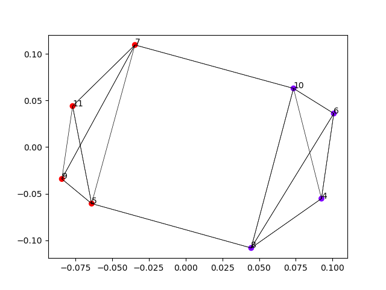

# Uitbreiding: Rekening houden met het aantal verdiepingen die met de trap genomen worden

In de vorige oplossingen keken we enkel naar welke verplaatsingen met de trap moesten gebeuren. We hielden echter geen rekening met hoeveel verdiepingen in zo’n verplaatsing zaten. We kunnen onze oplossing daar gemakkelijk aan aanpassen door het aantal verplaatsingen tussen twee verdiepingen te vermenigvuldigen met een kost om zich tussen die verdiepingen te verplaatsen.
In dat geval krijgen we de volgende bogenmatrix.

|  | **4** | **5** | **6** | **7** | **8** | **9** | **10** | **11** |
| - | - |- | - |- | - |- | - |- |
| **4** | 0 | 0 | 2x2 | 0 | 2x4 | 0 | 2x8 | 0 |
| **5** | 0 | 0 | 0 | 0 | 3x3 | 3x4 | 0 | 3x6 | 
| **6** | 1x2 | 0 | 0 | 0 | 1x2 | 0 | 2x4 | 0 | 
| **7** | 0 | 3x2 | 0 | 0 | 0 | 2x2 | 4x3 | 4x4 | 
| **8** | 2x4 | 3x3 | 2x2 | 0 | 0 | 0 | 2x2 | 0 | 
| **9** | 0 | 3x4 | 0 | 2x2 | 0 | 0 | 0 | 3x2 | 
| **10** | 0 | 0 | 3x4 | 2x3 | 2x2 | 0 | 0 | 0 |
| **11** | 0 | 1x6 | 0 | 1x4 | 0 | 0 | 0 | 0 |

Dan bekomen we de volgende bogenmatrix:

|  | **4** | **5** | **6** | **7** | **8** | **9** | **10** | **11** |
| - | - |- | - |- | - |- | - |- |
| **4** | 0 | 0 | 4 | 0 | 8 | 0 | 16 | 0 |
| **5** | 0 | 0 | 0 | 0 | 9 | 12 | 0 | 18 | 
| **6** | 2 | 0 | 0 | 0 | 2 | 0 | 8 | 0 | 
| **7** | 0 | 6 | 0 | 0 | 0 | 4 | 12 | 16 | 
| **8** | 8 | 9 | 4 | 0 | 0 | 0 | 4 | 0 | 
| **9** | 0 | 12 | 0 | 4 | 0 | 0 | 0 | 6 | 
| **10** | 0 | 0 | 12 | 6 | 4 | 0 | 0 | 0 |
| **11** | 0 | 6 | 0 | 4 | 0 | 0 | 0 | 0 |

Toevallig is de minimale knip in dit geval gelijk: 
De minimale kost is:  36
De verdeling van de verdiepingen over de liften is:  [1, 2, 1, 2, 1, 2, 1, 2]

Ook andere technieken geven hetzelfde resultaat. Dit is bijvoorbeeld de spectrale embedding:

