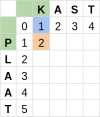
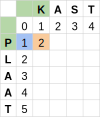
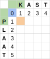
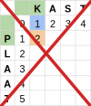
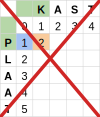
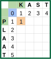

# Een algoritme (3)

Om de rest van de tabel in te vullen, maken we gebruik van de informatie die we al hebben. Zo moeten we onze redenering niet voor elk vakje helemaal opnieuw uitvoeren. We bestuderen hier eerst het geval om van P naar K te gaan. We kunnen dat op drie manieren doen:

1. We voegen K toe en laten P weg.
2. We laten P weg en voegen K toe.
3. We vervangen P door K.

    <table>
        <tr>
            <td style="width:375px;min-width:250px"></td>
            <td style="min-width:250px">De afstand om van P naar K te gaan schrijven we in het oranje vakje (2, 2). Hieronder bekijken we de drie manieren om dat te doen.</td>
        </tr>
        <tr>
            <td></td>
            <td>Manier 1: K toevoegen en P verwijderen. We kennen de kost al om K toe te voegen. Deze staat in het vakje boven het huidige vakje. Daar tellen we de kost bij op op P te verwijderen (= 1).</td>
        </tr>
        <tr>
            <td></td>
            <td>Manier 1: De totale kost is in dit geval dus 2.</td>
        </tr>
        <tr>
            <td></td>
            <td>Manier 2: P weglaten en K toevoegen. Daarvoor kijken we naar de kost om P weg te laten. Die staat in het vakje links van het huidige vakje. Deze kost is 1. Daar tellen we de kost bij om K toe te voegen (= 1)</td>
        </tr>
        <tr>
            <td></td>
            <td>Manier 2: De totale kost is in dit geval ook 2.</td>
        </tr>
        <tr>
            <td></td>
            <td>Manier 3: Hier kijken we naar de kost om van het lege woord naar het lege woord te gaan. Daarbij tellen we de kost om P te vervangen door K. In dit geval is die kost 1 omdat P en K verschillende letters zijn.</td>
        </tr>
        <tr>
            <td></td>
            <td>Manier 3: De totale kost is hier dus 1</td>
        </tr>
    </table>

We willen de minimale kost bepalen dus nemen we nu het minimum van deze drie gevallen en vullen die waarde permanent in in onze tabel.

    <table>
        <tr>
            <td></td>
            <td></td>
            <td></td>
        </tr>
    </table>

Op deze manier kunnen we de rest van de tabel invullen.