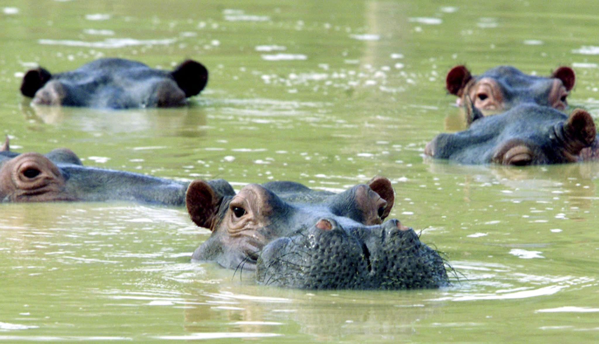

# Cocaïnenijlpaarden veroveren Colombia

Foto: FICG.mx. CC by 2.0.

Inleidende tekst: [EOS-blogpost Cocaïnenijlpaarden veroveren Colombia](https://www.eoswetenschap.eu/natuur-milieu/cocainenijlpaarden-veroveren-colombia)

Kijktip: [krantenartikel met video](https://www.nieuwsblad.be/opmerkelijk/hoe-de-kudde-nijlpaarden-die-ooit-van-pablo-escobar-was-blijft-groeien-ondanks-verwoede-pogingen-van-colombiaanse-regering/54711592.html) 

Pablo Escobar had op zijn landgoed niet alleen meren waarop hij kon jetskiën, maar ook een eigen vliegveld, een kartbaan, een arena voor stierengevechten en een private dierentuin. In 1981 heeft hij vier nijlpaarden, drie vrouwtjes en een mannetje, illegaal geïmporteerd vanuit de Verenigde Staten. 
Na de dood van Escobar in 1993 werden de meeste van zijn dieren naar andere dierentuinen overgebracht. Maar met die grote nijlpaarden wisten ze geen weg. Te zwaar, te groot, te gevaarlijk. Deze dieren hebben ze achtergelaten op dat landgoed. 
Na enige tijd kwam het landgoed in handen van de gemeente Puerto Triunfo. 
En de nijlpaarden die aan hun lot waren overgelaten? Die ontsnapten. 

Het landgoed ligt in de buurt van de Magdalena rivier in een gebied met een grote diversiteit aan fauna en flora. De nijlpaarden hebben er geen natuurlijke vijanden en voldoende water en voedsel. Bovendien kent de streek geen periodes van zware droogte zoals sommige streken in Afrika.

