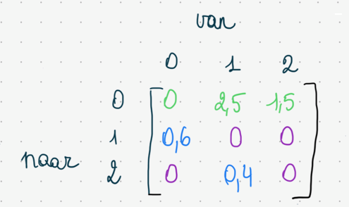
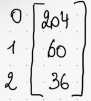
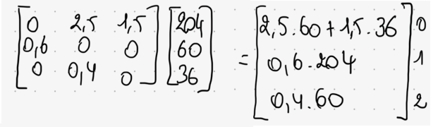
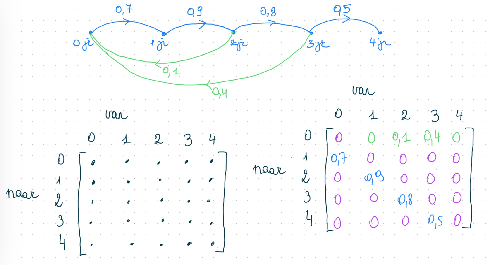

# Populatiegroei wiskundig modelleren a.d.h.v. Lesliematrix

Het vorige model geeft aan in welke mate de populatie verder zou kunnen aangroeien. Het geeft echter niet weer hoeveel mannelijke en hoeveel vrouwelijke nijlpaarden er zijn, en hoe bijvoorbeeld de verhouding jonge versus oude dieren is. 

Om dit te bekijken kan je een wiskundig model maken dat gebaseerd is op een *Lesliematrix*.

## Lesliematrix: voorbeeld
Vertrek van het volgende probleem:

Stel dat je een populatie dieren hebt van een soort die maximum twee jaar oud wordt. 
60 % van de nuljarigen wordt 1 jaar, en 40 % van de eenjarigen wordt 2 jaar. In het tweede levensjaar krijgen de vrouwtjes gemiddeld 5 nakomelingen en in het derde levensjaar krijgen ze er gemiddeld 3.  
Momenteel zijn er 204 dieren in hun eerste levensjaar, 60 dieren zijn een jaar oud en 36 zijn in hun derde levensjaar. 
Bekijk deze populatie dieren binnen 5 jaar.

De evolutie van deze populatie kan je modelleren a.d.h.v. een graaf: 

Vervolgens kan je deze graaf vertalen naar een matrix \[L\]: 

Een dergelijke matrix wordt een Lesliematrix genoemd. Het is een speciaal geval van een zogenaamde *overgangsmatrix*.

Ook de huidige populatie kan je voorstellen m.b.v. een matrix, namelijk, de volgende kolommatrix $B$:

Wanneer je de Lesliematrix vermenigvuldigt met deze kolommatrix bekom je het aantal nul-, een- en tweejarige dieren na een periode van een jaar: 

Noem de bekomen *'bevolkingsmatrix'* \[B_{1}\]

Voor een periode van twee jaar betekent dat: 
\\[B_{2} = L \cdot B_{1}\\] dus  
\\[B_{2} = L \cdot (L \cdot B_{0})\\] dus  
\\[B_{2} = L^{2} \cdot B_{0}\\]

Dus voor een periode van vijf jaar:
\\[B_{2} = L^{5} \cdot B_{0}\\]

Voor het rekenwerk kan je ook gebruikmaken van Python. Open daarvoor de tweede notebook. 

## Lesliematrix: oefening

Stel dat je een populatie dieren hebt van een soort die maximum vier jaar oud wordt. 
70 % van de nuljarigen wordt 1 jaar, 90 % van de eenjarigen wordt 2 jaar, 80 % van de tweejarigen wordt 3 jaar, en 50 % van de driejarigen wordt 4 jaar. In het derde levensjaar krijgen 100 vrouwtjes gemiddeld 20 nakomelingen en in het vierde levensjaar krijgen 100 vrouwtjes er gemiddeld 80.  
Momenteel zijn er 8 dieren in hun eerste levensjaar, 72 dieren zijn een jaar oud en 36 zijn in hun derde levensjaar, er zijn 9 driejarigen en 100 vierjarigen. 
Bekijk deze populatie dieren binnen 10 jaar.

