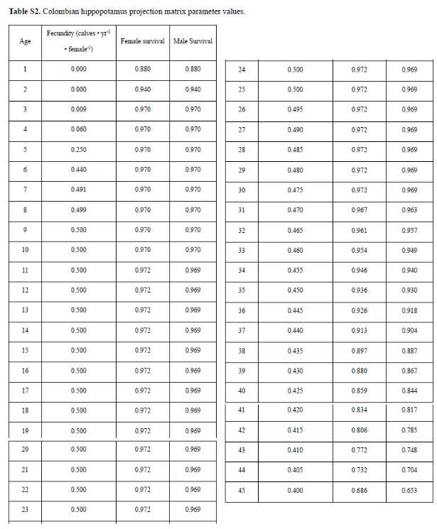

# Evolutie nijlpaardenpopulatie wiskundig modelleren a.d.h.v. een Lesliematrix

**Informatie i.v.m. maximale leeftijd en vruchtbaarheid [1]**

**Overlevingscijfers [1]**

Gebruik de derde notebook om de nijlpaardenpopulatie te modelleren m.b.v. een Lesliematrix.

Denk eerst na over hoe je de Lesliematrix die je nodig hebt om de nijlpaardenpopulatie te modelleren, zal opstellen.  

en kies de derde notebook (0200).

### Bronnen
[1] Subalusky, A.L., Sethi, S.A., Anderson, E.P. et al. Rapid population growth and high management costs have created a narrow window for control of introduced hippos in Colombia. *Sci Rep* 13, 6193 (2023). https://doi.org/10.1038/s41598-023-33028-y

