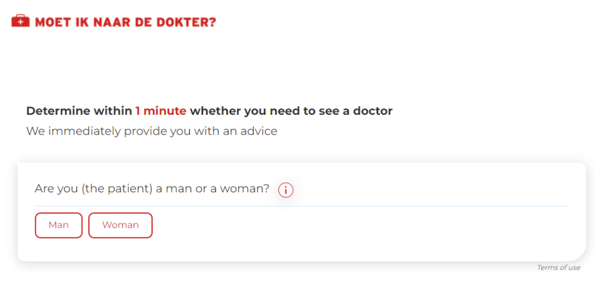
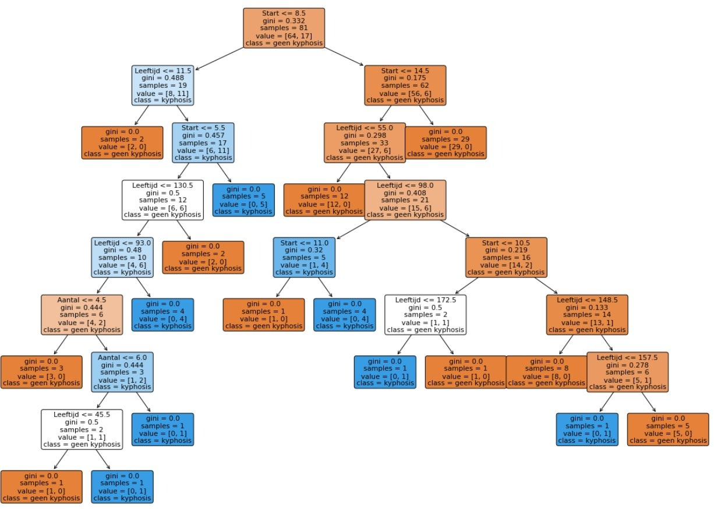

Een regelgebaseerd AI-systeem?
===============

Regelgebaseerde AI-systemen werken, zoals de naam al doet vermoeten, op basis van regels. Deze regels worden **verzonnen door experten** in een vakgebied en door een programmeur op de computer geprogrammeerd. Een voorbeeld van zo'n regelgebaseerd systeem is de toepassing ["Moet ik naar de dokter"](https://www.moetiknaardedokter.be/).

Deze toepassing stelt een reeks vragen aan de gebruiker en beslist op basis van de antwoorden welke actie ondernomen moet worden. Moet de persoon niet naar de dokter, moet die onmiddellijk naar de dokter, kan die morgen naar de dokter gaan of moet die nu naar de spoeddienst.

Zo'n systeem werkt aan de hand van een beslissingsboom. Hieronder zie je een voorbeeld van zo'n boom. 

Om een beslissing te nemen doorlopen we de boom van boven naar beneden. In elk vakje staat een vraag. Als het antwoord op die vraag **ja** is, dan volg je de **linkse lijn** naar beneden. Als het antwoord op de vraag **nee** is dan volg je de **rechtse lijn** naar beneden. Wanneer je helemaal onderaan de boom komt, dan zie je daar staan welke actie de peroon moet ondernemen.