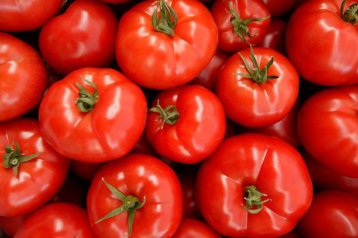

Een datagebaseerd AI-systeem?
===============

De toepassing "Moet ik naar de dokter" werkt op basis van regels die wij als mens verzonnen hebben. Voor sommige toepassingen is het voor de mens echter te complex om alle regels om een probleem op te lossen, te bedenken. Stel bijvoorbeeld dat we tomaten willen detecteren in afbeeldingen. Hoe zouden we dat dan doen? We moeten daarbij sowieso rekening houden met hoe de computer afbeeldingen voorstelt. Hieronder zie je een afbeelding van tomaten. Daarop zie je een klein geel vierkantje, in de rasters naast de afbeelding zoomen we in op dat vierkantje. Zo zien we dat de afbeelding bestaat uit drie rasters, een voor elke basiskleur (rood, groen en blauw). Een element in dat raster noemen we een pixel.

    <h2 class="title">Opdracht</h2>
    

        Welke regels kan jij bedenken om die tomaten te detecteren? 
        </img>
    

