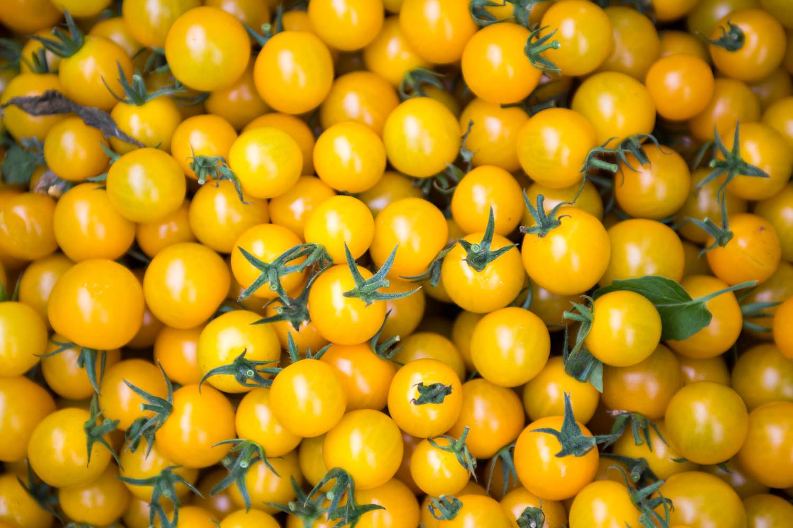
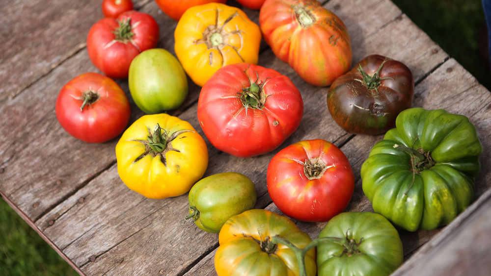

Een datagebaseerd AI-systeem?
===============

Je bedacht waarschijnlijk een aantal regels die keken naar bijvoorbeed de kleur, de vorm en de grootte van de tomaten. Dan zou je een systeem hebben dat goed werkt voor "gewone" tomaten maar natuurlijk bestaan er tomaten in allerlei soorten en maten. Bijvoorbeeld:

Je zal merken dat het snel heel complex wordt om regels te verzinnen waarmee je alle mogelijke soorten tomaten kan detecteren. Daarom hebben computerwetenschappers datagebaseerde AI-systemen bedacht. Deze systemen leren zelf de regels op basis van veel voorbeelddata.

