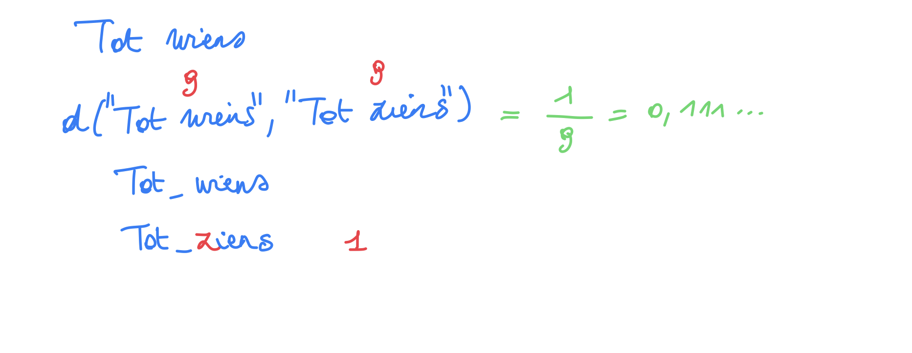
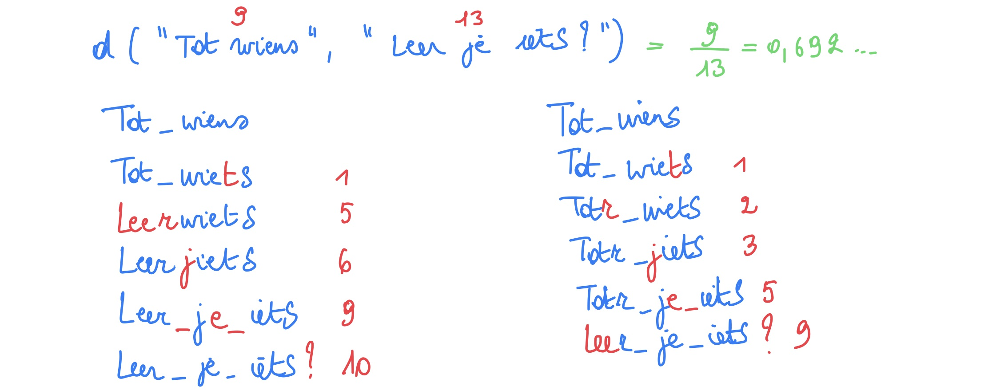

# Computationeel denken

Hoe kan een chatbot een gestelde vraag, die niet in zijn 'woordenboek' staat, koppelen aan een vraag die er wel in staat en het meest lijkt op de gestelde vraag?  

Maak gebruik van getallen! Een voorbeeld: 

Er wordt gekeken hoeveel karakters er moeten worden aangepast om de ene 'vraag' om te vormen naar een 'andere'. Ook het aantal karakters van de vragen speelt een rol.

