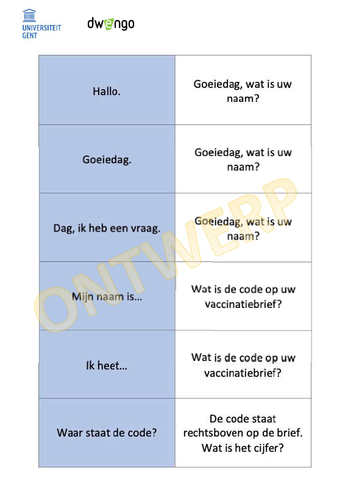
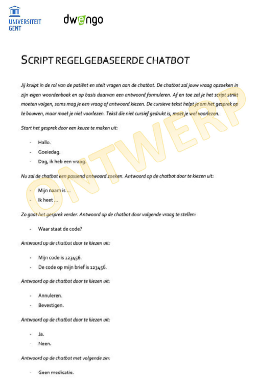

# Speel zelf chatbot

---------------------------------
#### Computationeel denken unplugged: werking van een regelgebaseerde chatbot
---------------------------------

Rollenspel:

Een van de leerlingen speelt de chatbot. Een andere leerling speelt de gebruiker.

De gebruiker heeft een script om een gesprek met de chatbot op poten te zetten. 

De chatbot heeft een kaartenset met aan de ene kant een mogelijk gestelde vraag en aan de andere kant het antwoord dat de chatbot moet geven.

 
 
