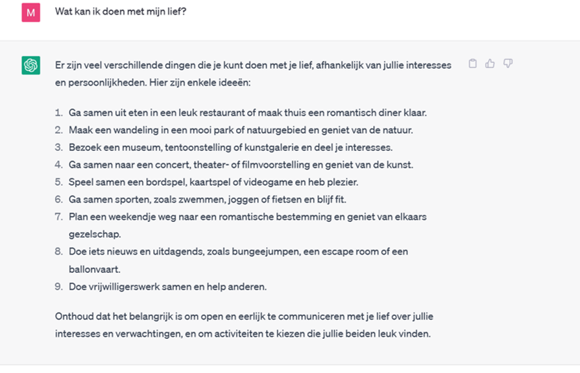

# Chatbot

* Lerende chatbots durven heel wat te verzinnen. 
* Regelgebaseerde chtabots doen dat niet, maar ook zij geven niet altijd correcte antwoorden. Als de vraag niet 'voorgeprogrammeerd' is, geven ze soms een antwoord die eigenlijk bij een andere vraag hoort. Of soms antwoorden ze dat ze je niet kunnen helpen, wat ook vervelend is. Je kan hier meer over lezen in [hoofdstuk 4 van de handleiding](https://dwengo.org/assets/files/chatbot/Chatbot_handleiding_eerstedruk.pdf) bij het chatbotproject.

Misschien een leuke afsluiter: 

