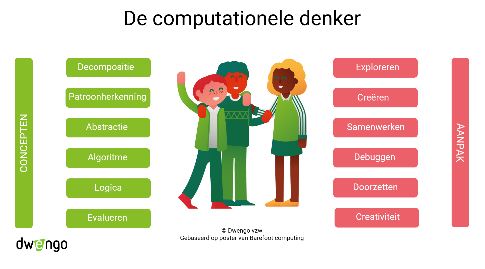

# Concepten en vaardigheden

## Veelvoorkomende concepten en vaardigheden

Computationeel denken kent heel wat concepten en praktijken.  
Op de poster zie je concepten van computationeel denken en manieren van aanpak. Deze lijst van concepten, praktijken en vaardigheden is niet volledig. Het valt bijvoorbeeld op dat 'modelleren' in de lijst ontbreekt. 

> In de definitie bij de uitgangspunten van de eindtermen van de eerste graad wordt modelleren expliciet vermeld (zie Leerpad 'Eindtermen').

Over de vier basisconcepten 'decompositie, patroonherkenning, abstractie en algortime' is er internationaal een consensus. Welke andere concepten en de praktijken men aanhaalt, durft nogal eens verschillen afhankelijk van wie het is, van de opleiding van die persoon en waarvoor die computationeel denken gebruikt. (Je las hier eerder over in het leerobject 'Aandachtspunt: Consensus'.) 
 

  
Deze poster is gebaseerd op een poster van *Barefoot Computing* uit het Verenigd Koninkrijk. 

## Icoontjes

In het lesmateriaal van Dwengo, zal je af en toe iconen tegenkomen. Hieronder vind je een overzicht terug. 

