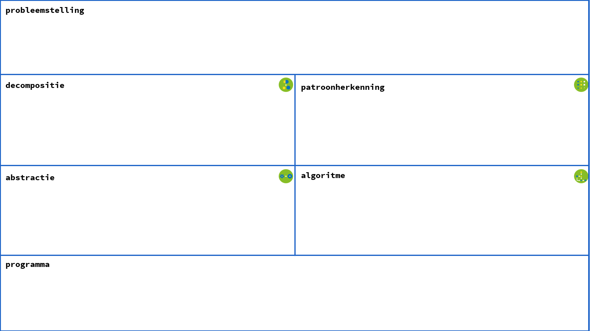

# Schema concepten computationeel denken

We stellen een schema voor dat jou, als leerkracht, een houvast biedt bij de voorbereiding van je lessen rond concepten van computationeel denken.

Bij het invullen van het schema vertrek je van de basisconcepten, maar automatisch komen ook andere concepten en praktijken van computationeel denken naar voren. 
Niet alle vakken moeten verplicht worden ingevuld. Het onderste vak 'programmeren' is facultatief. Programmeren hoeft niet altijd aan bod te komen. Zelfs de computer hoeft niet altijd aan bod te komen. Let wel, in geen enkele opdracht met de computer werken is ook geen optie.  

In het leerpad ['Cases'](https://www.dwengo.org/learning-path.html?hruid=ct6_cases&language=nl&te=true&source_page=%2Fcomputational_thinking%2F&source_title=%20Computationeel%20Denken#ct_cases0;nl;3) vind je heel wat voorbeelden uit de lespraktijk die uitgewerkt werden met dit schema. 

